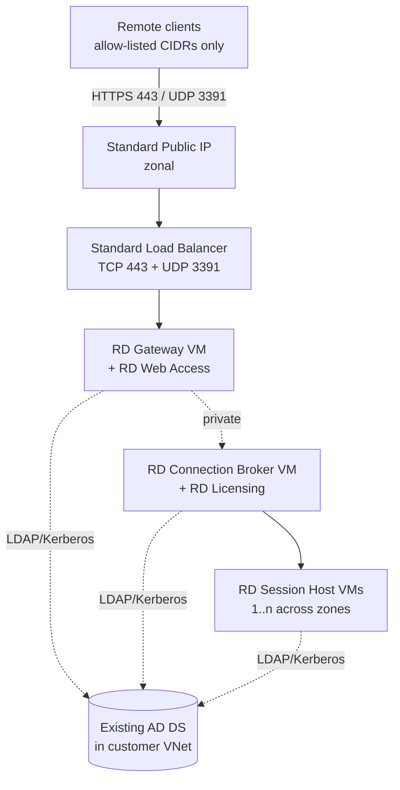
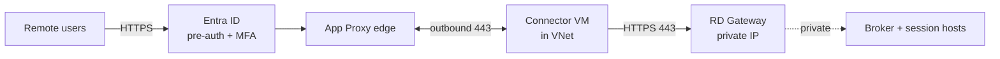
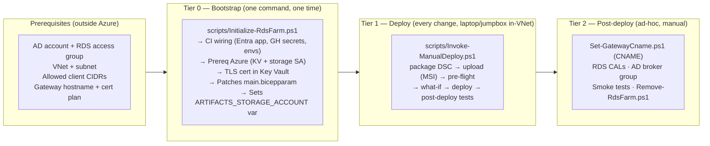

# RDS Farm on Azure (Bicep + DSC)

Modernized Bicep deployment for a Microsoft Remote Desktop Services (RDS) farm joined to an **existing** Active Directory domain.

This template replaces the legacy [`Azure/RDS-Templates`](https://github.com/Azure/RDS-Templates) and [`azure-quickstart-templates/.../rds-deployment-existing-ad`](https://github.com/Azure/azure-quickstart-templates/tree/master/application-workloads/rds/rds-deployment-existing-ad) samples, which use retired Basic-SKU networking and (in the quickstart case) directly expose Gateway and Broker VMs to the internet.

---

## What it deploys

| Component | Count | Network exposure |
| --- | --- | --- |
| Public IP (Standard, zone-redundant) | 1 (public-LB mode) | Internet → LB only |
| Standard Load Balancer | 1 (public-LB mode) | TCP 443, UDP 3391 → Gateway pool |
| RD Gateway / RD Web Access VM | 1 | Private IP (joined to the LB backend in public-LB mode) |
| RD Connection Broker / RD Licensing VM | 1 | Private only |
| RD Session Host VMs | `sessionHostCount` (default 2) | Private only |
| Subnet NSG allow rules | 2 (public-LB mode) | TCP 443 + UDP 3391 from allow-listed CIDRs, written to the existing governance NSG (no NIC NSG) |
| Entra app proxy connector VM | 1 (App Proxy mode) | **Outbound only** — no public ingress |
| Azure Bastion (Standard) | 1 (optional) | Admin access only |
| User-assigned Managed Identity (cert flow) | 1 (optional) | KV Secrets User |

> [!NOTE]
> **Two ingress modes.** By default the farm fronts the gateway with a public
> Standard Load Balancer. Set `useAppProxy` (Tier 0 `-UseAppProxy`) to publish
> through **Microsoft Entra application proxy** instead — no public IP/LB, no
> internet inbound rules, an outbound-only connector VM, and Entra
> pre-authentication. Design + cutover: [docs/app-proxy.md](docs/app-proxy.md).

All VMs use **Trusted Launch**, **Premium SSD managed disks**, **AutomaticByPlatform patching**, and **availability zones**. RDS roles are installed and configured by **PowerShell DSC** (`dsc/Configuration.ps1`). TLS certificates can optionally be pulled from **Azure Key Vault** via the Key Vault VM extension and bound to all four RDS roles automatically.

### Architecture



> **App Proxy mode** (`useAppProxy`) removes the public IP + LB and the internet
> inbound rules. An outbound-only connector dials Microsoft's edge, and users
> authenticate to Entra ID (Conditional Access + MFA) before reaching the gateway:



Full design and cutover runbook: [docs/app-proxy.md](docs/app-proxy.md).

---

## Deployment guide

The flow is **prerequisites → Tier 0 → Tier 1 → Tier 2**. Tier 1 (the actual farm deploy) runs from a laptop or jumpbox with line-of-sight to the VNet — see the note below on why the GitHub Actions pipeline can't run it today.



| Phase | When | Where | Goal |
| --- | --- | --- | --- |
| **Prerequisites** | Before anything | AD / network / DNS — outside Azure | Things this repo can't create for you (AD account + group, VNet + subnet, client CIDRs, hostname plan). |
| **Tier 0 — Bootstrap** | Once, before first deploy | Your laptop | One script ([`scripts/Initialize-RdsFarm.ps1`](scripts/Initialize-RdsFarm.ps1)) does it all: GitHub Actions wiring, Azure prereq RGs/KV/SA, TLS cert, fully patched `main.bicepparam`. |
| **Tier 1 — Deploy** | Every code change | **Laptop / jumpbox with VNet line-of-sight** | `package DSC → upload (MSI) → pre-flight → what-if → deploy → post-deploy tests`. |
| **Tier 2 — Post-deploy** | Ad-hoc | Your laptop | Public CNAME, RDS CALs activation, AD `Terminal Server License Servers` membership, smoke tests, tear-down. |

> [!NOTE]
> **Deploy from inside the VNet (laptop on VPN or a jumpbox).** The artifacts
> storage account and Key Vault are private-endpoint-only (public network access
> disabled). The GitHub-hosted pipeline runner sits outside the VNet, so its
> pre-deploy checks (blob reachability, Key Vault cert read, `az deployment group
> validate`) can't reach those resources and the run fails. Until a **self-hosted
> runner inside the VNet** is set up, run [`scripts/Invoke-ManualDeploy.ps1`](scripts/Invoke-ManualDeploy.ps1)
> from a machine with line-of-sight to the VNet. It packages DSC via
> [`scripts/Publish-DscArtifact.ps1`](scripts/Publish-DscArtifact.ps1), runs the
> readiness gate, then `what-if` + `create`. Full steps: [`docs/manual-deploy.md`](docs/manual-deploy.md).

For a printable / tickable version of the steps below, see [`docs/manual-checklist.md`](docs/manual-checklist.md).

### Prerequisites — things outside this repo's scope

These five items exist before you ever touch this repo. They live in AD, networking, or DNS, so no script can create them for you. Tier 0 will prompt you for the values that name them.

| Item | Who creates it | Notes |
| --- | --- | --- |
| **AD service account for domain-join** | AD admin | Delegated rights to create / join machine objects in the target OU (or in the default `Computers` container if you don't pass `-DomainJoinOuPath`). You'll supply its password to Tier 0 once (stored as the `DOMAIN_JOIN_PASSWORD` GitHub secret). Default sAMAccountName: `svc-domainjoin`. |
| **AD security group for RDS access** | AD admin | Members of this group can sign in via RD Web + RD Gateway. Use `Domain Users` for a quick lab; a dedicated group like `RDS-Users` for prod. |
| **Existing Azure VNet + subnet** | Network admin | Subnet must route to a DC (DNS, LDAP, Kerberos, SMB). Optionally add an `AzureBastionSubnet` (/26) if you want Bastion. |
| **Allowed client source CIDRs** | You | Office / VPN egress IPs that may reach `TCP 443` + `UDP 3391`. **Never `0.0.0.0/0`.** |
| **Gateway hostname + cert plan** | You | Vanity CNAME like `rds.contoso.com` (production — requires a public-CA cert) or the free `*.cloudapp.azure.com` hostname (lab only, paired with a self-signed cert). Decision rationale + what Tier 0 does for each: [`docs/fqdn-and-cert.md`](docs/fqdn-and-cert.md). |

You also need on your **laptop** for Tier 0: PowerShell 7+, `az` CLI signed in (`az login`), `gh` CLI signed in (`gh auth login --scopes repo`), Owner on the target subscription, and Application Developer in the Entra tenant.

### Tier 0 — Bootstrap (one command)

A single script orchestrates everything Tier 0 needs. It calls the focused per-area scripts in the right order, prompts for missing inputs, and never persists secrets to disk.

```powershell
./scripts/Initialize-RdsFarm.ps1 `
    -GitHubRepo 'contoso/rds-farm' `
    -AdDomainName contoso.local -AdDnsServerIp 10.10.0.4 `
    -RdsAccessGroup 'RDS-Users' `
    -ExistingVnetName corp-vnet `
    -ExistingVnetResourceGroup network-rg `
    -ExistingRdsSubnetName snet-rds `
    -AllowedClientSourceAddressPrefixes '203.0.113.0/24','198.51.100.10/32' `
    -PublicGatewayFqdn rds.contoso.com `
    -ArtifactsStorageAccount contosordsart01 `
    -KeyVaultName contoso-rds-kv01 `
    -CertMode Csr `
    -RequireProductionApproval
```

Any required value you omit is prompted for interactively (with sensible defaults shown in brackets). Lab shortcut: `./scripts/Initialize-RdsFarm.ps1 -GitHubRepo 'me/rds-farm' -CertMode SelfSigned` — the script asks for the rest. Add `-Interactive` to also be prompted for every *optional* parameter (defaults pre-filled).

In one pass it wires GitHub Actions, deploys the prereq Azure resources, issues the TLS cert in Key Vault, and writes a fully populated `main.bicepparam`. You don't hand-edit the bicepparam afterwards. Per-step breakdown: [`docs/manual-checklist.md`](docs/manual-checklist.md).

#### `Initialize-RdsFarm.ps1` parameters

Required values are marked **yes**. Anything else has a sensible default — omit it and the script uses the default (or prompts when interactive).

| Parameter | Required | Default | Description |
| --- | --- | --- | --- |
| `-GitHubRepo` | **yes** | — | `<owner>/<repo>`. Used for OIDC federated credentials and `gh` secret targeting. |
| `-SubscriptionId` | no | `az account show` | Azure subscription to deploy into. |
| `-Location` | no | `westeurope` | Region for the prereq RGs / KV / SA and the farm. |
| `-AdDomainName` | **yes** | — | AD FQDN, e.g. `contoso.local`. |
| `-AdDnsServerIp` | **yes** | — | IP of a DC the new VMs can reach for DNS. |
| `-DomainJoinUserName` | no | `svc-domainjoin` | sAMAccountName of the pre-created domain-join service account. |
| `-DomainJoinOuPath` | no | *empty* → default `Computers` container | DN of the OU to drop the VM computer objects into, e.g. `OU=RDS,OU=Servers,DC=contoso,DC=local`. The `-DomainJoinUserName` account needs **Create Computer Objects** delegated on that OU. |
| `-LocalAdminUserName` | no | `rdsadmin` | Local admin username on every RDS VM. |
| `-RdsAccessGroup` | no | `Domain Users` | AD security group whose members may sign in via RD Web + RD Gateway. |
| `-ExistingVnetName` | **yes** | — | Pre-existing VNet hosting the RDS subnet. |
| `-ExistingVnetResourceGroup` | **yes** | — | Resource group of the existing VNet. |
| `-ExistingRdsSubnetName` | **yes** | — | Subnet for the RDS VMs. |
| `-AllowedClientSourceAddressPrefixes` | **yes** | — | `string[]` of CIDRs allowed to reach TCP 443 / UDP 3391. **Never `0.0.0.0/0`.** |
| `-PublicGatewayFqdn` | **yes** for `Csr` / `ImportPfx` — optional for `SelfSigned` | for `SelfSigned`, derived from `-GatewayDnsLabelPrefix` + `-Location` as `<label>.<region>.cloudapp.azure.com` | Public hostname clients type. Must match the TLS cert Subject / SAN. Public CAs cannot sign for `cloudapp.azure.com`, so a vanity FQDN is required outside the self-signed lab path. |
| `-GatewayDnsLabelPrefix` | **yes** for `SelfSigned` without `-PublicGatewayFqdn`, otherwise no | sanitised `-PublicGatewayFqdn` (vanity path) / from the repo name (lab path, prompted) | DNS label for the Azure-managed PIP hostname. Must be globally unique. |
| `-ArtifactsStorageAccount` | **yes** | — | Globally unique storage account name (3–24 chars, lowercase alphanumeric) for `Configuration.zip`. |
| `-KeyVaultName` | **yes** | — | Globally unique Key Vault name (3–24 chars) for the TLS cert. |
| `-ArtifactsResourceGroup` | no | `rds-artifacts-rg` | RG for the artifacts SA. |
| `-KeyVaultResourceGroup` | no | `rds-security-rg` | RG for the Key Vault. |
| `-CertMode` | **yes** | — | `Csr` (production, two-pass) / `ImportPfx` / `SelfSigned`. Full mode comparison: [`docs/fqdn-and-cert.md`](docs/fqdn-and-cert.md). |
| `-PfxPath` | only when `-CertMode ImportPfx` | — | Path to the existing `.pfx` file. Password prompted as `SecureString`. |
| `-CertName` | no | `rds-tls` | Name of the cert object in Key Vault. |
| `-AppDisplayName` | no | `gh-rds-farm-deploy` | Display name for the Entra app the pipeline uses. |
| `-RequireProductionApproval` | switch | off | Mark the `production` GitHub environment as requiring approval from the current `gh` user. Requires GH Pro/Team/Enterprise on private repos. |
| `-BicepParamFile` | no | `<repo>/main.bicepparam` | Path to the bicepparam to patch. |
| `-SkipCiBootstrap` | switch | off | Skip CI wiring (use only when `Initialize-CiPrerequisites.ps1` already ran successfully). |
| `-SkipPrereqsDeploy` | switch | off | Skip the prereqs Bicep (use only when KV + SA already exist and you pass their names). |
| `-Interactive` | switch | off | Also prompt for every **optional** parameter above (defaults pre-filled — press Enter to keep each). Without this switch only the required values are prompted; optionals silently use their defaults. |

`Get-Help ./scripts/Initialize-RdsFarm.ps1 -Full` shows the same set with extended notes.

**Csr mode is two-pass.** The first run generates a CSR file, then halts before the bicepparam is overwritten with an incomplete cert URI. Submit the CSR to your CA, then re-run `Initialize-RdsFarm.ps1` (or [`scripts/New-RdsCertificate.ps1`](scripts/New-RdsCertificate.ps1) directly with `-MergeSignedCert`) to finish.

**Idempotent.** Re-running is safe: existing Entra apps / RBAC / KV / SA / GH secrets are reused; the bicepparam is re-patched in place (a `.bak` backup is written).

#### Parameters reference (`main.bicepparam`)

The values below are baked into [`main.bicepparam`](main.bicepparam) during Tier 0. This table is the per-parameter source-of-truth: which rows Tier 0 sets for you (`file`), which it leaves as `readEnvironmentVariable(...)` (`env var`), and which the pipeline overrides at run time (`CI override`).

| Source | Meaning |
| --- | --- |
| **file** | You (or Tier 0) write the literal value into [`main.bicepparam`](main.bicepparam). Both CI and laptop runs read it as-is. |
| **env var** | Param uses `readEnvironmentVariable(...)`. CI injects from a GitHub secret; laptop runs use `$env:` (the helper scripts prompt). **Do not put a literal value in the file.** |
| **CI override** | The pipeline passes `--parameters <name>=<value>` from a previous job's output. The value in the file is only used by laptop runs ([`scripts/Invoke-ManualDeploy.ps1`](scripts/Invoke-ManualDeploy.ps1) sets it too). |

| Parameter | Required | Source | Description |
| --- | --- | --- | --- |
| `existingVnetName`, `existingVnetResourceGroup`, `existingRdsSubnetName` | yes | file | Target VNet / subnet (can be in another RG). |
| `adDomainName` | yes | file | FQDN of the existing AD domain, e.g. `contoso.local`. |
| `adDnsServerIp` | yes | file | Private IP of an AD DNS server reachable from the subnet. |
| `domainJoinUserName` | yes | file | Service account user name for domain join (password below). |
| `domainJoinPassword` | yes | **env var** | `$env:DOMAIN_JOIN_PASSWORD`. CI secret `DOMAIN_JOIN_PASSWORD` (set by [`scripts/Initialize-CiPrerequisites.ps1`](scripts/Initialize-CiPrerequisites.ps1)). |
| `domainJoinOuPath` | no (default empty) | file | DN of the target OU (e.g. `OU=RDS,OU=Servers,DC=contoso,DC=local`). Empty = default `CN=Computers` container. |
| `localAdminUserName` | yes | file | Local admin user name on every VM. |
| `localAdminPassword` | yes | **env var** | `$env:LOCAL_ADMIN_PASSWORD`. CI secret `LOCAL_ADMIN_PASSWORD`. |
| `sessionHostCount` | no (default `2`) | file | 1–20 RDSH VMs, spread across `availabilityZones`. |
| `vmSize` | no (`Standard_D4s_v5`) | file | Used for every RDS VM. |
| `windowsSku` | no (`2022-datacenter-azure-edition`) | file | Azure Edition recommended (hotpatch capable). |
| `allowedClientSourceAddressPrefixes` | yes | file | CIDRs allowed to reach 443 / UDP 3391. **Do not use `0.0.0.0/0`.** |
| `subnetNsgName` | no (auto-set by Tier 0) | file | Governance NSG already attached to the RDS subnet. The farm writes the allow-list (443 / UDP 3391) as named rules here instead of attaching its own NIC NSG. Tier 0 discovers it from the live subnet; empty = skip writing rules. |
| `gatewayDnsLabelPrefix` | yes | file | Becomes `<prefix>.<region>.cloudapp.azure.com`. |
| `deployBastion` | no (`true`) | file | Set `false` if you already have Bastion in a hub VNet. |
| `availabilityZones` | no (`['1','2','3']`) | file | Reduce if the region has fewer zones. |
| `artifactsLocation` | yes | **CI override** (file for laptop) | Base URL of the blob container holding `Configuration.zip`. Must end with `/`. The `upload-artifacts` pipeline job overrides this from the `ARTIFACTS_STORAGE_ACCOUNT` repo variable (set by Tier 0); for laptop deploys the value already in `main.bicepparam` is used. |
| `artifactsStorageAccountName` | yes | file | Storage account hosting `Configuration.zip`. The Bicep grants the VMs' UAMI **Storage Blob Data Reader** on this SA so the DSC extension can OAuth-download the blob (no SAS — tenant policy blocks both shared keys and SAS). |
| `artifactsStorageAccountResourceGroup` | yes | file | Resource group of `artifactsStorageAccountName`. |
| `sessionHostNamingPrefix` | no (`rds-sh-`) | file | Must match what the broker DSC uses to compute FQDNs. |
| `collectionName` | no | file | RDS session collection name. |
| `rdsAccessGroup` | no (`Domain Users`) | file | sAMAccountName of the AD security group whose members can sign in to the collection and through the RD Gateway. |
| `enableCertificateBinding` | no (`false`) | file | Enables the KV → cert binding flow. Tier 0 sets this `true` for any `-CertMode` other than the `Csr` first pass. |
| `keyVaultName`, `keyVaultResourceGroup` | only if cert binding | file | The KV Tier 0 provisioned (or an existing one). |
| `keyVaultCertSecretUri` | only if cert binding | file | `https://<vault>.vault.azure.net/secrets/<cert>`. [`scripts/Set-BicepParamCertUri.ps1`](scripts/Set-BicepParamCertUri.ps1) patches it for you. |
| `publicGatewayFqdn` | only if cert binding (recommended) | file | Public hostname clients type. Wired into RD Gateway's `GatewayExternalFqdn` and the `rdWebUrl` output. Leave empty to use the LB FQDN (lab / dev only — see [`docs/fqdn-and-cert.md`](docs/fqdn-and-cert.md)). |
| `certificateSubject` | only if cert binding | file | Subject substring to locate the cert (e.g. `CN=rds.contoso.com`). |

### Tier 1 — Deploy (laptop / jumpbox)

After Tier 0 finishes, commit `main.bicepparam` so the config is version-controlled:

```powershell
git add main.bicepparam
git commit -m 'Initialize farm config'
```

Then deploy from a machine with line-of-sight to the VNet — a laptop on VPN, or a jumpbox in a peered network (see the note below on why a GitHub-hosted runner can't do this):

```powershell
# Preview the change
./scripts/Invoke-ManualDeploy.ps1 -Action what-if -StorageAccount <artifactsSA>

# Apply
./scripts/Invoke-ManualDeploy.ps1 -Action deploy  -StorageAccount <artifactsSA>
```

The wrapper packages DSC via [`scripts/Publish-DscArtifact.ps1`](scripts/Publish-DscArtifact.ps1), runs the [`tests/Test-PreDeployReadiness.ps1`](tests/Test-PreDeployReadiness.ps1) gate, then `az deployment group what-if` and `create`. It prompts for `DOMAIN_JOIN_PASSWORD` / `LOCAL_ADMIN_PASSWORD` if they aren't already in your shell. Full step-by-step, plus the by-hand `az` equivalents: [`docs/manual-deploy.md`](docs/manual-deploy.md).

Typical wall-clock time on `Standard_D4s_v5`: **25–40 min** (VM provisioning + domain-join reboot + DSC role install + RDS deployment). Afterwards run [`tests/Test-PostDeployHealth.ps1`](tests/Test-PostDeployHealth.ps1) to confirm every VM extension succeeded, the LB backend is healthy, DNS resolves, and `https://<gatewayFqdn>/RDWeb/` is reachable. What the deploy actually does to the VMs (Bicep + DSC, 12 steps): [`docs/manual-deploy.md`](docs/manual-deploy.md#what-the-deployment-does-end-to-end). Test details: [`docs/testing.md`](docs/testing.md).

> [!NOTE]
> **Why not the GitHub Actions pipeline?** The artifacts storage account and Key Vault are private-endpoint-only (public network access disabled). A GitHub-hosted runner sits outside the VNet, so the pipeline's pre-deploy checks (blob reachability, Key Vault cert read, `az deployment group validate`) can't reach those resources and the run fails. The workflow and its reference ([`docs/ci-cd.md`](docs/ci-cd.md)) are kept for when a **self-hosted runner inside the VNet** is configured — until then, deploy from a laptop/jumpbox as above. The pipeline reads the **same** `main.bicepparam` and calls the **same** [`scripts/Publish-DscArtifact.ps1`](scripts/Publish-DscArtifact.ps1), so the two paths stay in sync.

```powershell
# Preview only (artifacts get published; readiness checks run; deployment is what-if)
./scripts/Invoke-ManualDeploy.ps1 -Action what-if -StorageAccount contosordsart01

# Apply (prompts for DOMAIN_JOIN_PASSWORD / LOCAL_ADMIN_PASSWORD if not already in env)
./scripts/Invoke-ManualDeploy.ps1 -Action deploy  -StorageAccount contosordsart01
```

Equivalent broken-down `az` commands (when scripts fail and you want to debug): [`docs/manual-deploy.md`](docs/manual-deploy.md).

### Tier 2 — Post-deploy operations

After the first successful deploy you need to do four things, **none** of which are inside Bicep's scope:

1. **Public CNAME** *(vanity-FQDN deploys only)* — point `rds.contoso.com` → the `gatewayFqdn` output of the deployment. For Azure DNS:

   ```powershell
   ./scripts/Set-GatewayCname.ps1 -ZoneName contoso.com -RecordName rds -Verify
   ```

   For other DNS providers (Cloudflare, GoDaddy, Route 53…) create the CNAME by hand using [`docs/manual-deploy.md#7a-public-dns-cname-vanity-fqdn-only`](docs/manual-deploy.md#7a-public-dns-cname-vanity-fqdn-only). Decision rationale: [`docs/fqdn-and-cert.md`](docs/fqdn-and-cert.md).
2. **Activate the license server** on the broker via *RD Licensing Manager → Activate Server* and install your real RDS CALs. The deploy runs in the 120-day per-user grace period until you do this.
3. **Add the broker computer to AD `Terminal Server License Servers`** group (requires Domain Admin — outside the rights granted to the domain-join service account).
4. **Smoke tests.** Run Sections 2–4 of [`docs/testing.md`](docs/testing.md) for an end-to-end client check.

Tear-down when the lab is no longer needed:

```powershell
./scripts/Remove-RdsFarm.ps1                              # farm RG only, interactive
./scripts/Remove-RdsFarm.ps1 -IncludeArtifactsRg -Force   # also nukes the prereqs RGs
```

---

## Repository layout

```text
rds-farm/
├── README.md                   # this file (overview + deployment guide + nav)
├── main.bicep                  # entry point
├── main.bicepparam             # environment values
├── dsc/
│   └── Configuration.ps1       # SessionHost / Gateway / RDSDeployment configs
├── modules/
│   ├── network.bicep           # existing subnet lookup + allow-list rules on governance NSG
│   ├── loadbalancer.bicep      # Standard PIP + LB
│   ├── bastion.bicep           # optional Azure Bastion (Standard)
│   ├── vm.bicep                # VM + NIC + domain-join + (optional) KV ext
│   ├── dsc.bicep               # DSC extension wrapper
│   ├── identity.bicep          # user-assigned MSI for cert flow
│   └── kv-role.bicep           # role assignment on existing Key Vault
├── prereqs/                    # OPTIONAL — provision the Key Vault + DSC storage account
│   ├── tier0.bicep             # subscription-scope entry point (Tier 0)
│   ├── tier0.bicepparam
│   └── modules/
│       ├── keyvault.bicep
│       └── storage.bicep
├── docs/                       # detailed guides linked from the Documentation table below
│   ├── manual-checklist.md      # printable companion to the Deployment guide
│   ├── prereq-resources.md      # the prereqs/ Bicep template (KV + storage SA)
│   ├── fqdn-and-cert.md         # hostname + cert decisions and what Tier 0 does with them
│   ├── manual-deploy.md         # consolidated by-hand procedures (cert, CNAME, az commands)
│   ├── ci-cd.md
│   ├── testing.md
│   └── troubleshooting.md
├── tests/                      # automated infra + config tests (used by deploy.yml)
│   ├── Test-DscConfiguration.ps1       # PSScriptAnalyzer + parse + Configuration discovery
│   ├── Test-BicepParamValues.ps1       # compile main.bicepparam + value-invariant checks
│   ├── Test-PostDeployHealth.ps1       # post-deploy: extensions, RH, LB, DNS, RD Web
│   ├── Test-CiPrerequisites.ps1        # verify Initialize-CiPrerequisites.ps1 output (read-only)
│   ├── Test-PreDeployReadiness.ps1     # local equivalent of CI pre-deploy-checks job
│   └── Test-RdsFarmInit.ps1            # one-command verifier for everything Initialize-RdsFarm.ps1 set up
├── scripts/                    # bootstrap + helper scripts
│   ├── Initialize-RdsFarm.ps1          # Tier-0 ORCHESTRATOR — calls the four below in order
│   ├── Initialize-CiPrerequisites.ps1  # Tier-0: Entra app + federated creds + RBAC + GitHub secrets
│   ├── Publish-DscArtifact.ps1         # zip + upload Configuration.zip (--auth-mode login, no SAS)
│   ├── Invoke-ManualDeploy.ps1         # Tier-1 laptop/jumpbox deploy (the working path)
│   ├── New-RdsCertificate.ps1          # create/import TLS cert in Key Vault (CSR/PFX/SelfSigned)
│   ├── Set-BicepParamCertUri.ps1       # patch cert-related params in main.bicepparam in place
│   ├── Set-GatewayCname.ps1            # Tier-2: set vanity-FQDN CNAME in Azure DNS (idempotent)
│   └── Remove-RdsFarm.ps1              # Tier-2: tear down farm RG (optional artifacts/security RGs)
└── .github/workflows/
    └── deploy.yml              # OIDC-based CI/CD with what-if on PR
```

---

## 📚 Documentation

The README above is the deployment guide. For deeper reference on a specific area:

| Guide | Read this when… |
| --- | --- |
| [Deploy from scratch — runbook](docs/runbook.md) | **Start here.** One linear top-to-bottom walkthrough: empty subscription → working RD Web sign-in (prereqs → Tier 0 → laptop/jumpbox deploy → post-deploy). |
| [Manual setup checklist](docs/manual-checklist.md) | You want a tickable / printable version of the [Deployment guide](#deployment-guide) above. |
| [Prerequisite resources (Key Vault + storage)](docs/prereq-resources.md) | You want to provision the prereq Key Vault and DSC storage account automatically instead of pre-creating them by hand. |
| [Gateway FQDN and TLS certificate](docs/fqdn-and-cert.md) | Deciding the public hostname (Azure LB vs vanity CNAME) and cert mode (Csr / ImportPfx / SelfSigned). Explains what Tier 0 does for each combination. |
| [Manual deploy](docs/manual-deploy.md) | The working deploy path (laptop/jumpbox with VNet line-of-sight). What the deployment does end-to-end (12 steps), plus the underlying `az` commands for cert creation, bicepparam editing, deploy, and CNAME. |
| [CI/CD with GitHub Actions](docs/ci-cd.md) | Wiring up the included `.github/workflows/deploy.yml` (OIDC federated creds, RBAC, env approval). |
| [Testing & verification](docs/testing.md) | Five-stage smoke tests from pre-deploy `what-if` to end-to-end client RDP. |
| [Troubleshooting](docs/troubleshooting.md) | "Why doesn't this work?" — failures grouped by tier with the most likely fix. |
| [Entra application proxy](docs/app-proxy.md) | **Design blueprint (not yet implemented).** Target architecture for replacing the public LB with Microsoft Entra application proxy: outbound-only connector, Entra pre-auth, vanity FQDN + Let's Encrypt cert. |

---

## License

MIT. The DSC role-deployment script is derived from the structure used by the historical `Azure/RDS-Templates` repository, modernized for current PowerShell `RemoteDesktop` cmdlets.
