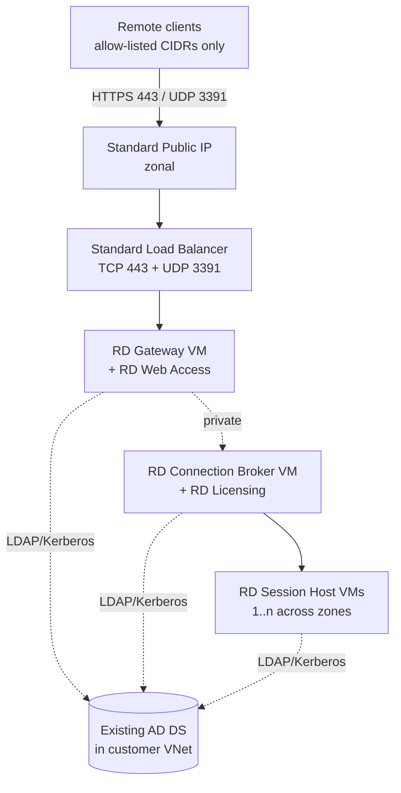
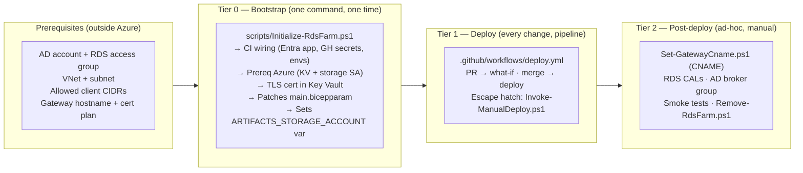

# RDS Farm on Azure (Bicep + DSC)

Modernized Bicep deployment for a Microsoft Remote Desktop Services (RDS) farm joined to an **existing** Active Directory domain.

This template replaces the legacy [`Azure/RDS-Templates`](https://github.com/Azure/RDS-Templates) and [`azure-quickstart-templates/.../rds-deployment-existing-ad`](https://github.com/Azure/azure-quickstart-templates/tree/master/application-workloads/rds/rds-deployment-existing-ad) samples, which use retired Basic-SKU networking and (in the quickstart case) directly expose Gateway and Broker VMs to the internet.

---

## What it deploys

| Component | Count | Network exposure |
| --- | --- | --- |
| Public IP (Standard, zone-redundant) | 1 | Internet → LB only |
| Standard Load Balancer | 1 | TCP 443, UDP 3391 → Gateway pool |
| RD Gateway / RD Web Access VM | 1 | Private IP, joined to LB backend |
| RD Connection Broker / RD Licensing VM | 1 | Private only |
| RD Session Host VMs | `sessionHostCount` (default 2) | Private only |
| Network Security Group | 1 | Allow-list source CIDRs |
| Azure Bastion (Standard) | 1 (optional) | Admin access only |
| User-assigned Managed Identity (cert flow) | 1 (optional) | KV Secrets User |

All VMs use **Trusted Launch**, **Premium SSD managed disks**, **AutomaticByPlatform patching**, and **availability zones**. RDS roles are installed and configured by **PowerShell DSC** (`dsc/Configuration.ps1`). TLS certificates can optionally be pulled from **Azure Key Vault** via the Key Vault VM extension and bound to all four RDS roles automatically.

### Architecture



---

## Deployment guide

The flow is **prerequisites → Tier 0 → Tier 1 → Tier 2**. The pipeline is the supported deploy path; a laptop "escape hatch" exists for when CI is unavailable but it isn't a parallel workflow you have to maintain.



| Phase | When | Where | Goal |
| --- | --- | --- | --- |
| **Prerequisites** | Before anything | AD / network / DNS — outside Azure | Things this repo can't create for you (AD account + group, VNet + subnet, client CIDRs, hostname plan). |
| **Tier 0 — Bootstrap** | Once, before first deploy | Your laptop | One script ([`scripts/Initialize-RdsFarm.ps1`](scripts/Initialize-RdsFarm.ps1)) does it all: GitHub Actions wiring, Azure prereq RGs/KV/SA, TLS cert, fully patched `main.bicepparam`. |
| **Tier 1 — Deploy** | Every code change | **GitHub Actions pipeline** (escape hatch: laptop) | `package DSC → upload → SAS → pre-flight → what-if → deploy → post-deploy tests`. |
| **Tier 2 — Post-deploy** | Ad-hoc | Your laptop | Public CNAME, RDS CALs activation, AD `Terminal Server License Servers` membership, smoke tests, tear-down. |

> [!NOTE]
> **Pipeline is the supported deploy path.** Tier 0 always wires up GitHub Actions because every change is meant to flow through PR-with-what-if → merge-to-deploy. The laptop wrapper [`scripts/Invoke-ManualDeploy.ps1`](scripts/Invoke-ManualDeploy.ps1) exists as a one-off escape hatch (e.g. CI is down, or you're debugging the Bicep itself); it reads the **same** `main.bicepparam` and calls the **same** [`scripts/Publish-DscArtifact.ps1`](scripts/Publish-DscArtifact.ps1) the workflow does, so the two paths can't drift.

For a printable / tickable version of the steps below, see [`docs/manual-checklist.md`](docs/manual-checklist.md).

### Prerequisites — things outside this repo's scope

These five items exist before you ever touch this repo. They live in AD, networking, or DNS, so no script can create them for you. Tier 0 will prompt you for the values that name them.

| Item | Who creates it | Notes |
| --- | --- | --- |
| **AD service account for domain-join** | AD admin | Delegated rights to join machines to the target OU. You'll supply its password to Tier 0 once (stored as the `DOMAIN_JOIN_PASSWORD` GitHub secret). Default sAMAccountName: `svc-domainjoin`. |
| **AD security group for RDS access** | AD admin | Members of this group can sign in via RD Web + RD Gateway. Use `Domain Users` for a quick lab; a dedicated group like `RDS-Users` for prod. |
| **Existing Azure VNet + subnet** | Network admin | Subnet must route to a DC (DNS, LDAP, Kerberos, SMB). Optionally add an `AzureBastionSubnet` (/26) if you want Bastion. |
| **Allowed client source CIDRs** | You | Office / VPN egress IPs that may reach `TCP 443` + `UDP 3391`. **Never `0.0.0.0/0`.** |
| **Gateway hostname plan** | You | Vanity CNAME like `rds.contoso.com` (production — requires a public cert) or the free `*.cloudapp.azure.com` hostname (lab only, paired with a self-signed cert). See [`docs/gateway-fqdn.md`](docs/gateway-fqdn.md). |

Full reference with parameter mappings: [`docs/parameters-reference.md`](docs/parameters-reference.md).

You also need on your **laptop** for Tier 0: PowerShell 7+, `az` CLI signed in (`az login`), `gh` CLI signed in (`gh auth login --scopes repo`), Owner on the target subscription, and Application Developer in the Entra tenant.

### Tier 0 — Bootstrap (one command)

A single script orchestrates everything Tier 0 needs. It calls the focused per-area scripts in the right order, prompts for missing inputs, and never persists secrets to disk.

```powershell
./scripts/Initialize-RdsFarm.ps1 `
    -GitHubRepo 'contoso/rds-farm' `
    -AdDomainName contoso.local -AdDnsServerIp 10.10.0.4 `
    -RdsAccessGroup 'RDS-Users' `
    -ExistingVnetName corp-vnet `
    -ExistingVnetResourceGroup network-rg `
    -ExistingRdsSubnetName snet-rds `
    -AllowedClientSourceAddressPrefixes '203.0.113.0/24','198.51.100.10/32' `
    -PublicGatewayFqdn rds.contoso.com `
    -ArtifactsStorageAccount contosordsart01 `
    -KeyVaultName contoso-rds-kv01 `
    -CertMode Csr `
    -RequireProductionApproval
```

Any required value you omit is prompted for interactively (with sensible defaults shown in brackets). Lab shortcut: `./scripts/Initialize-RdsFarm.ps1 -GitHubRepo 'me/rds-farm' -CertMode SelfSigned` — the script asks for the rest.

In one pass it wires GitHub Actions, deploys the prereq Azure resources, issues the TLS cert in Key Vault, and writes a fully populated `main.bicepparam`. You don't hand-edit the bicepparam afterwards. Per-step breakdown: [`docs/manual-checklist.md`](docs/manual-checklist.md). Parameter-by-parameter reference: [`docs/parameters-reference.md`](docs/parameters-reference.md).

**Csr mode is two-pass.** The first run generates a CSR file, then halts before the bicepparam is overwritten with an incomplete cert URI. Submit the CSR to your CA, then re-run `Initialize-RdsFarm.ps1` (or [`scripts/New-RdsCertificate.ps1`](scripts/New-RdsCertificate.ps1) directly with `-MergeSignedCert`) to finish.

**Idempotent.** Re-running is safe: existing Entra apps / RBAC / KV / SA / GH secrets are reused; the bicepparam is re-patched in place (a `.bak` backup is written).

### Tier 1 — Deploy (pipeline)

After Tier 0 finishes, commit `main.bicepparam` and push:

```powershell
git add main.bicepparam
git commit -m 'Initialize farm config'
git push
```

| Trigger | What runs |
| --- | --- |
| PR to `main` | `lint → config-tests → upload-artifacts → pre-deploy-checks → what-if`. The what-if diff is posted as a (collapsible) PR comment by `github-actions[bot]` and also written to the run's job summary. |
| Merge to `main` | All of the above plus `deploy` (gated by the `production` environment) and `post-deploy-tests`. |
| `workflow_dispatch` | Same plus the `prereqs_action` toggle (`use-existing` / `what-if` / `deploy-new`) — useful if you want CI to re-validate the prereqs deployment Tier 0 already did, or to redeploy them after editing [`prereqs/main.bicep`](prereqs/main.bicep). |

Typical wall-clock time on `Standard_D4s_v5`: **25–40 min**. The `post-deploy-tests` job runs [`tests/Test-PostDeployHealth.ps1`](tests/Test-PostDeployHealth.ps1) and confirms every VM extension succeeded, LB backend is healthy, DNS resolves, and `https://<gatewayFqdn>/RDWeb/` returns 200. Full CI/CD reference: [`docs/ci-cd.md`](docs/ci-cd.md). What the deploy actually does to the VMs (Bicep + DSC, 12 steps): [`docs/manual-deploy.md`](docs/manual-deploy.md#what-the-deployment-does-end-to-end). Test details: [`docs/testing.md`](docs/testing.md).

#### Escape hatch — laptop deploy

Use this **only** when CI is unavailable (workflow disabled / GitHub outage) or when you're iterating on the Bicep itself. It reads the same `main.bicepparam`, calls the same [`scripts/Publish-DscArtifact.ps1`](scripts/Publish-DscArtifact.ps1), automatically runs the same [`tests/Test-PreDeployReadiness.ps1`](tests/Test-PreDeployReadiness.ps1) gate as the pipeline's `pre-deploy-checks` job, and runs the same `az deployment group what-if` / `create`. The only thing it bypasses is the workflow's environment approval gate.

```powershell
# Preview only (artifacts get published; readiness checks run; deployment is what-if)
./scripts/Invoke-ManualDeploy.ps1 -Action what-if -StorageAccount contosordsart01

# Apply (prompts for DOMAIN_JOIN_PASSWORD / LOCAL_ADMIN_PASSWORD if not already in env)
./scripts/Invoke-ManualDeploy.ps1 -Action deploy  -StorageAccount contosordsart01
```

Equivalent broken-down `az` commands (when scripts fail and you want to debug): [`docs/manual-deploy.md`](docs/manual-deploy.md).

### Tier 2 — Post-deploy operations

After the first successful deploy you need to do four things, **none** of which are inside Bicep's scope:

1. **Public CNAME** *(vanity-FQDN deploys only)* — point `rds.contoso.com` → the `gatewayFqdn` output of the deployment. For Azure DNS:

   ```powershell
   ./scripts/Set-GatewayCname.ps1 -ZoneName contoso.com -RecordName rds -Verify
   ```

   For other DNS providers (Cloudflare, GoDaddy, Route 53…) create the CNAME by hand using [`docs/gateway-fqdn.md#step-b-create-the-cname-after-the-first-deploy-you-need-gatewayfqdn`](docs/gateway-fqdn.md#step-b-create-the-cname-after-the-first-deploy-you-need-gatewayfqdn).
2. **Activate the license server** on the broker via *RD Licensing Manager → Activate Server* and install your real RDS CALs. The deploy runs in the 120-day per-user grace period until you do this.
3. **Add the broker computer to AD `Terminal Server License Servers`** group (requires Domain Admin — outside the rights granted to the domain-join service account).
4. **Smoke tests.** Run Sections 2–4 of [`docs/testing.md`](docs/testing.md) for an end-to-end client check.

Tear-down when the lab is no longer needed:

```powershell
./scripts/Remove-RdsFarm.ps1                              # farm RG only, interactive
./scripts/Remove-RdsFarm.ps1 -IncludeArtifactsRg -Force   # also nukes the prereqs RGs
```

---

## Repository layout

```text
rds-farm/
├── README.md                   # this file (overview + deployment guide + nav)
├── main.bicep                  # entry point
├── main.bicepparam             # environment values
├── dsc/
│   └── Configuration.ps1       # SessionHost / Gateway / RDSDeployment configs
├── modules/
│   ├── network.bicep           # NSG + existing subnet lookup
│   ├── loadbalancer.bicep      # Standard PIP + LB
│   ├── bastion.bicep           # optional Azure Bastion (Standard)
│   ├── vm.bicep                # VM + NIC + domain-join + (optional) KV ext
│   ├── dsc.bicep               # DSC extension wrapper
│   ├── identity.bicep          # user-assigned MSI for cert flow
│   └── kv-role.bicep           # role assignment on existing Key Vault
├── prereqs/                    # OPTIONAL — provision the Key Vault + DSC storage account
│   ├── main.bicep              # subscription-scope entry point
│   ├── main.bicepparam
│   └── modules/
│       ├── keyvault.bicep
│       └── storage.bicep
├── docs/                       # detailed guides linked from the Documentation table below
│   ├── manual-checklist.md      # printable companion to the Deployment guide
│   ├── parameters-reference.md  # per-parameter source (file / env var / CI override)
│   ├── prereq-resources.md      # the prereqs/ Bicep template (KV + storage SA)
│   ├── gateway-fqdn.md
│   ├── key-vault-cert.md
│   ├── manual-deploy.md         # escape-hatch az commands + what the deploy does
│   ├── ci-cd.md
│   ├── testing.md
│   └── troubleshooting.md
├── tests/                      # automated infra + config tests (used by deploy.yml)
│   ├── Test-DscConfiguration.ps1       # PSScriptAnalyzer + parse + Configuration discovery
│   ├── Test-BicepParamValues.ps1       # compile main.bicepparam + value-invariant checks
│   ├── Test-PostDeployHealth.ps1       # post-deploy: extensions, RH, LB, DNS, RD Web
│   ├── Test-CiPrerequisites.ps1        # verify Initialize-CiPrerequisites.ps1 output (read-only)
│   └── Test-PreDeployReadiness.ps1     # local equivalent of CI pre-deploy-checks job
├── scripts/                    # bootstrap + helper scripts
│   ├── Initialize-RdsFarm.ps1          # Tier-0 ORCHESTRATOR — calls the four below in order
│   ├── Initialize-CiPrerequisites.ps1  # Tier-0: Entra app + federated creds + RBAC + GitHub secrets
│   ├── Publish-DscArtifact.ps1         # zip + upload Configuration.zip + mint user-delegation SAS
│   ├── Invoke-ManualDeploy.ps1         # Tier-1 laptop escape hatch (no CI required)
│   ├── New-RdsCertificate.ps1          # create/import TLS cert in Key Vault (CSR/PFX/SelfSigned)
│   ├── Set-BicepParamCertUri.ps1       # patch cert-related params in main.bicepparam in place
│   ├── Set-GatewayCname.ps1            # Tier-2: set vanity-FQDN CNAME in Azure DNS (idempotent)
│   └── Remove-RdsFarm.ps1              # Tier-2: tear down farm RG (optional artifacts/security RGs)
└── .github/workflows/
    └── deploy.yml              # OIDC-based CI/CD with what-if on PR
```

---

## 📚 Documentation

The README above is the deployment guide. For deeper reference on a specific area:

| Guide | Read this when… |
| --- | --- |
| [Manual setup checklist](docs/manual-checklist.md) | You want a tickable / printable version of the [Deployment guide](#deployment-guide) above. |
| [Parameters reference](docs/parameters-reference.md) | You want the per-parameter source-of-truth for `main.bicepparam` (file / env var / CI override). |
| [Prerequisite resources (Key Vault + storage)](docs/prereq-resources.md) | You want to provision the prereq Key Vault and DSC storage account automatically instead of pre-creating them by hand. |
| [Choosing your gateway FQDN](docs/gateway-fqdn.md) | Deciding between the free Azure LB hostname (lab only) and a vanity CNAME (production). |
| [Key Vault prep](docs/key-vault-cert.md) | Setting up the TLS cert for the four RDS roles — vault RBAC, CSR/PFX import/self-signed flows, and renewal. |
| [Manual deploy (escape hatch)](docs/manual-deploy.md) | What the deployment does end-to-end (12 steps), plus the underlying `az` commands when CI is unavailable. |
| [CI/CD with GitHub Actions](docs/ci-cd.md) | Wiring up the included `.github/workflows/deploy.yml` (OIDC federated creds, RBAC, env approval). |
| [Testing & verification](docs/testing.md) | Five-stage smoke tests from pre-deploy `what-if` to end-to-end client RDP. |
| [Troubleshooting](docs/troubleshooting.md) | "Why doesn't this work?" — failures grouped by tier with the most likely fix. |

---

## License

MIT. The DSC role-deployment script is derived from the structure used by the historical `Azure/RDS-Templates` repository, modernized for current PowerShell `RemoteDesktop` cmdlets.
