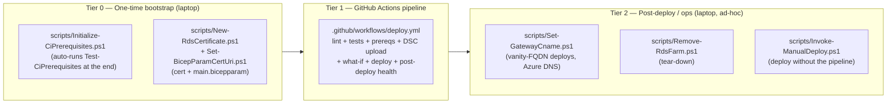
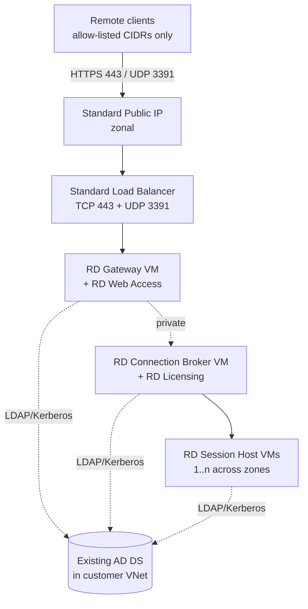

# RDS Farm on Azure (Bicep + DSC)

Modernized Bicep deployment for a Microsoft Remote Desktop Services (RDS) farm joined to an **existing** Active Directory domain.

This template replaces the legacy [`Azure/RDS-Templates`](https://github.com/Azure/RDS-Templates) and [`azure-quickstart-templates/.../rds-deployment-existing-ad`](https://github.com/Azure/azure-quickstart-templates/tree/master/application-workloads/rds/rds-deployment-existing-ad) samples, which use retired Basic-SKU networking and (in the quickstart case) directly expose Gateway and Broker VMs to the internet.

---

## 📚 Documentation

| Guide | Read this when… |
| --- | --- |
| [Prerequisites & parameters reference](docs/prerequisites.md) | Planning the deployment — required infra, accounts, and the full `main.bicepparam` reference. |
| [Prerequisite resources (Key Vault + storage)](docs/prereqs.md) | You want to provision the prereq Key Vault and DSC storage account automatically instead of pre-creating them by hand. |
| [Choosing your gateway FQDN](docs/gateway-fqdn.md) | Deciding between the free Azure LB hostname (lab only) and a vanity CNAME (production). |
| [Key Vault prep](docs/key-vault-cert.md) | Setting up the TLS cert for the four RDS roles — vault RBAC, CSR/PFX import/self-signed flows, and renewal. |
| [Deployment](docs/deployment.md) | Step-by-step manual deploy: package DSC, set secrets, fill bicepparam, run `az deployment group create`. |
| [Testing & verification](docs/testing.md) | Five-stage smoke tests from pre-deploy `what-if` to end-to-end client RDP. |
| [Troubleshooting](docs/troubleshooting.md) | "Why doesn't this work?" — the most common failures and their fixes. |
| [CI/CD with GitHub Actions](docs/ci-cd.md) | Wiring up the included `.github/workflows/deploy.yml` (OIDC federated creds, RBAC, env approval). |
| [When to use AVD instead](docs/avd-comparison.md) | Deciding whether to use this template or Azure Virtual Desktop. |

---

## 🚀 How to deploy — three tiers

The end-to-end flow splits into three tiers. Tier 0 runs **once** from a human's laptop; Tier 1 is the **pipeline** (re-runnable for every change); Tier 2 is **post-deploy** scripts you reach for as needed.



| Tier | Trigger | Lives where | What runs |
| --- | --- | --- | --- |
| **Tier 0 — bootstrap** | You, one time | Your laptop | [`scripts/Initialize-CiPrerequisites.ps1`](scripts/Initialize-CiPrerequisites.ps1) — creates Entra app + federated creds + RBAC + GitHub secrets/variables/environments, then auto-runs [`tests/Test-CiPrerequisites.ps1`](tests/Test-CiPrerequisites.ps1) as a self-check. **Cert setup** is also Tier 0: [`scripts/New-RdsCertificate.ps1`](scripts/New-RdsCertificate.ps1) + [`scripts/Set-BicepParamCertUri.ps1`](scripts/Set-BicepParamCertUri.ps1) (human-gated — CSR submission, private-key custody). |
| **Tier 1 — pipeline** | `git push` / `workflow_dispatch` | [`.github/workflows/deploy.yml`](.github/workflows/deploy.yml) | Lint → `tests/Test-DscConfiguration.ps1` → `tests/Test-BicepParamValues.ps1` → optional `prereqs` deploy → [`scripts/Publish-DscArtifact.ps1`](scripts/Publish-DscArtifact.ps1) (zip + upload + mint SAS) → pre-deploy infra checks → `what-if` → (on `main`) deploy → `tests/Test-PostDeployHealth.ps1`. **Re-runnable** for every code change. |
| **Tier 2 — ops** | You, ad-hoc | Your laptop | [`scripts/Set-GatewayCname.ps1`](scripts/Set-GatewayCname.ps1) (vanity CNAME in Azure DNS, post first deploy), [`scripts/Remove-RdsFarm.ps1`](scripts/Remove-RdsFarm.ps1) (tear-down). [`scripts/Invoke-ManualDeploy.ps1`](scripts/Invoke-ManualDeploy.ps1) is the **pipeline-free escape hatch** for laptop deploys; [`tests/Test-PreDeployReadiness.ps1`](tests/Test-PreDeployReadiness.ps1) mirrors the pipeline's `pre-deploy-checks` job locally. |

> [!NOTE]
> **One source of truth.** The pipeline's DSC upload step in Tier 1 calls the **same** [`scripts/Publish-DscArtifact.ps1`](scripts/Publish-DscArtifact.ps1) that [`scripts/Invoke-ManualDeploy.ps1`](scripts/Invoke-ManualDeploy.ps1) uses locally — so laptop and CI runs cannot drift apart.

The detailed manual checklist below maps every action to its tier and the script (if any) that automates it.

---

## What it deploys

| Component | Count | Network exposure |
| --- | --- | --- |
| Public IP (Standard, zone-redundant) | 1 | Internet → LB only |
| Standard Load Balancer | 1 | TCP 443, UDP 3391 → Gateway pool |
| RD Gateway / RD Web Access VM | 1 | Private IP, joined to LB backend |
| RD Connection Broker / RD Licensing VM | 1 | Private only |
| RD Session Host VMs | `sessionHostCount` (default 2) | Private only |
| Network Security Group | 1 | Allow-list source CIDRs |
| Azure Bastion (Standard) | 1 (optional) | Admin access only |
| User-assigned Managed Identity (cert flow) | 1 (optional) | KV Secrets User |

All VMs use **Trusted Launch**, **Premium SSD managed disks**, **AutomaticByPlatform patching**, and **availability zones**. RDS roles are installed and configured by **PowerShell DSC** (`dsc/Configuration.ps1`). TLS certificates can optionally be pulled from **Azure Key Vault** via the Key Vault VM extension and bound to all four RDS roles automatically.

### Architecture



---

## 🛠️ Manual setup checklist

> [!IMPORTANT]
> The template does **not** touch Active Directory, DNS, your CA, GitHub, or Microsoft 365. Everything below is a **you** task. Work through it in order — later items depend on earlier ones.
>
> **One-command shortcut:** [`scripts/Invoke-ManualDeploy.ps1`](scripts/Invoke-ManualDeploy.ps1) bundles steps 10, 13, and 14. Other steps have inline `scripts/` callouts.

### Phase 1 — Active Directory & networking *(before first deploy)*

- [ ] **1. AD DS reachable from the target subnet.** A DC with DNS, LDAP, Kerberos, and SMB reachable from the subnet you'll deploy into. See [Prerequisites](docs/prerequisites.md).
- [ ] **2. Domain-join service account.** Pre-create a service account that has delegated rights to join machines to the target OU. Its password goes into `$env:DOMAIN_JOIN_PASSWORD`.
- [ ] **3. Test AD user + security group.** Create a group (e.g. `RDS-Users`) in your AD, add the test user, and set `rdsAccessGroup` to its sAMAccountName. The template never writes to AD. (Use `Domain Users` for a quick lab.)
- [ ] **4. Target VNet + subnet exist.** A subnet that can route to the DC. Optionally an `AzureBastionSubnet` (/26) if you want `deployBastion = true`.
- [ ] **5. Allowed client source IPs.** Decide the CIDR list for `allowedClientSourceAddressPrefixes` — your office/VPN egress IPs only. **Never use `0.0.0.0/0`.**

### Phase 2 — Hostname & TLS certificate *(before first deploy)*

- [ ] **6. Pick the gateway hostname strategy.** Vanity CNAME like `rds.contoso.com` (production) or the free Azure LB hostname (lab/dev only). See [Choosing your gateway FQDN](docs/gateway-fqdn.md).
- [ ] **7. Provision the Key Vault.** Existing or new vault in your subscription with `enableRbacAuthorization = true`. Grant yourself `Key Vault Certificates Officer`. See [Key Vault prep → Step 1](docs/key-vault-cert.md#step-1-make-sure-the-vault-uses-rbac-not-access-policies). *You can let the pipeline create the vault for you — see [Prerequisite resources](docs/prereqs.md).*
- [ ] **8. Create or import the TLS cert.** Pick Option A (CSR + public CA), Option B (import existing PFX), or Option C (self-signed for lab). **Cert policy MUST be `exportable: true`.** See [Key Vault prep → Step 2](docs/key-vault-cert.md#step-2-create-the-certificate). *Scripted shortcut:* [`scripts/New-RdsCertificate.ps1`](scripts/New-RdsCertificate.ps1) handles all three modes and enforces `exportable: true`.
- [ ] **9. Capture the cert's secret URI.** Run `az keyvault certificate show --query sid` and strip the version segment → put into `keyVaultCertSecretUri`. See [Step 3](docs/key-vault-cert.md#step-3-get-the-secret-uri-and-put-it-in-mainbicepparam). *Scripted shortcut:* [`scripts/Set-BicepParamCertUri.ps1`](scripts/Set-BicepParamCertUri.ps1) patches the param file in place (or run `New-RdsCertificate.ps1 -OutputBicepParam main.bicepparam` to chain steps 8 and 9).

### Phase 3 — Artifacts storage *(before first deploy)*

- [ ] **10. Storage account + `dsc` container.** Hosts the `Configuration.zip` that VMs download via the DSC extension. *You can let the pipeline create both — see [Prerequisite resources](docs/prereqs.md) and run with `prereqs_action: deploy-new`.* Otherwise pre-create the account and the container.
- [ ] **11. *(CI only)* GitHub Actions wiring.** Entra app + federated credentials + Azure RBAC + GitHub repo secrets/variables/environments. See [CI/CD with GitHub Actions](docs/ci-cd.md).

### Phase 4 — Deploy

- [ ] **12. Fill in `main.bicepparam`.** All required values from [Prerequisites → Parameters reference](docs/prerequisites.md#parameters-reference).
- [ ] **13. Export deployment secrets in your shell.** `DOMAIN_JOIN_PASSWORD`, `LOCAL_ADMIN_PASSWORD`, `ARTIFACTS_SAS`.
- [ ] **14. Run the deployment.** `az deployment group create -g rds-farm-rg --parameters main.bicepparam` — full walkthrough in [Deployment](docs/deployment.md). Wall-clock: 25–40 min. *Scripted shortcut:* [`scripts/Invoke-ManualDeploy.ps1`](scripts/Invoke-ManualDeploy.ps1) bundles publish-DSC + what-if + deploy.

### Phase 5 — After the first deploy

- [ ] **15. Create the public CNAME** *(vanity-FQDN deployments only)*. Point `rds.contoso.com` → `gatewayFqdn` output (TTL 300). See [Gateway FQDN → Step B](docs/gateway-fqdn.md#step-b-create-the-cname-after-the-first-deploy-you-need-gatewayfqdn). *Scripted shortcut for Azure DNS:* [`scripts/Set-GatewayCname.ps1`](scripts/Set-GatewayCname.ps1) reads `gatewayFqdn` from the deployment outputs and upserts the CNAME (use `-Verify` to probe `https://<fqdn>/RDWeb/`).
- [ ] **16. Install RDS CALs on the broker.** Open *RD Licensing Manager* → Activate Server. The deployment runs in the 120-day grace period until you do this.
- [ ] **17. Add the broker computer to AD `Terminal Server License Servers` group.** Requires Domain Admin; outside the rights granted to the domain-join service account. Without it the broker can't hand out CALs after grace expires.
- [ ] **18. Run smoke tests.** Sections 2–4 of [Testing & verification](docs/testing.md#2-post-deployment-azure-side-smoke-tests).

---

## What's automated end-to-end

From a clean pipeline run, the template does the following **without any manual step on the VMs** before the test user can sign in to RD Web:

| # | Step | Where it runs | How |
| --- | --- | --- | --- |
| 1 | Provision NSG, LB, Public IP, NICs, VMs (Trusted Launch) | ARM control plane | Bicep |
| 2 | Set NIC DNS → your existing DC IP (`adDnsServerIp`) | VM NIC | Bicep (`dnsSettings.dnsServers`) |
| 3 | **Domain-join every VM** to your existing AD | VM | `JsonADDomainExtension` v1.3 (`Options: 3`) |
| 4 | Install RDS roles (`RDS-Gateway`, `RDS-Web-Access`, `RPC-over-HTTP-Proxy`, `RDS-Connection-Broker`, `RDS-Licensing`, `RDS-RD-Server`, RSAT) | VM | DSC `WindowsFeature` resources |
| 5 | `New-RDSessionDeployment` (broker + web access + session hosts) | Broker | DSC `Script CreateRDSDeployment` |
| 6 | `Add-RDServer -Role RDS-GATEWAY -GatewayExternalFqdn <publicGatewayFqdn>` | Broker | same script |
| 7 | `Add-RDServer -Role RDS-LICENSING` + `Set-RDLicenseConfiguration -Mode PerUser` (120-day grace) | Broker | same script |
| 8 | `Set-RDDeploymentGatewayConfiguration` — force traffic through gateway, cache RD Web creds | Broker | same script |
| 9 | `New-RDSessionCollection` (default `DesktopCollection`) | Broker | same script |
| 10 | `Set-RDSessionCollectionConfiguration -UserGroup <netbios>\<rdsAccessGroup>` | Broker | same script |
| 11 | **Create default RD CAP + RAP scoped to `rdsAccessGroup`** so the gateway actually accepts sessions | Gateway | DSC `Script ConfigureRDGatewayPolicies` (uses `RDS:\GatewayServer` PSDrive) |
| 12 | Optional: pull TLS cert from Key Vault → `Set-RDCertificate` for all 4 roles | Broker | KV VM extension + DSC `Script BindRDSCertificates` |

After step 12 returns success, opening `https://<publicGatewayFqdn>/RDWeb/` from a client in an allow-listed CIDR and signing in as any member of `rdsAccessGroup` returns the `DesktopCollection` desktop.

---

## Repository layout

```text
rds-farm/
├── README.md                   # this file (overview + manual checklist + nav)
├── main.bicep                  # entry point
├── main.bicepparam             # environment values
├── dsc/
│   └── Configuration.ps1       # SessionHost / Gateway / RDSDeployment configs
├── modules/
│   ├── network.bicep           # NSG + existing subnet lookup
│   ├── loadbalancer.bicep      # Standard PIP + LB
│   ├── bastion.bicep           # optional Azure Bastion (Standard)
│   ├── vm.bicep                # VM + NIC + domain-join + (optional) KV ext
│   ├── dsc.bicep               # DSC extension wrapper
│   ├── identity.bicep          # user-assigned MSI for cert flow
│   └── kv-role.bicep           # role assignment on existing Key Vault
├── prereqs/                    # OPTIONAL — provision the Key Vault + DSC storage account
│   ├── main.bicep              # subscription-scope entry point
│   ├── main.bicepparam
│   └── modules/
│       ├── keyvault.bicep
│       └── storage.bicep
├── docs/                       # detailed guides linked from the table above
│   ├── prerequisites.md
│   ├── prereqs.md
│   ├── gateway-fqdn.md
│   ├── key-vault-cert.md
│   ├── deployment.md
│   ├── testing.md
│   ├── troubleshooting.md
│   ├── ci-cd.md
│   └── avd-comparison.md
├── tests/                      # automated infra + config tests (used by deploy.yml)
│   ├── Test-DscConfiguration.ps1       # PSScriptAnalyzer + parse + Configuration discovery
│   ├── Test-BicepParamValues.ps1       # compile main.bicepparam + value-invariant checks
│   ├── Test-PostDeployHealth.ps1       # post-deploy: extensions, RH, LB, DNS, RD Web
│   ├── Test-CiPrerequisites.ps1        # verify Initialize-CiPrerequisites.ps1 output (read-only)
│   └── Test-PreDeployReadiness.ps1     # local equivalent of CI pre-deploy-checks job
├── scripts/                    # bootstrap + helper scripts
│   ├── Initialize-CiPrerequisites.ps1  # Tier-0: Entra app + federated creds + RBAC + GitHub secrets
│   ├── Publish-DscArtifact.ps1         # zip + upload Configuration.zip + mint user-delegation SAS
│   ├── Invoke-ManualDeploy.ps1         # end-to-end manual deploy wrapper (no CI required)
│   ├── New-RdsCertificate.ps1          # create/import TLS cert in Key Vault (CSR/PFX/SelfSigned)
│   ├── Set-BicepParamCertUri.ps1       # patch cert-related params in main.bicepparam in place
│   ├── Set-GatewayCname.ps1            # set vanity-FQDN CNAME in Azure DNS (idempotent)
│   └── Remove-RdsFarm.ps1              # tear down farm RG (optional artifacts/security RGs)
└── .github/workflows/
    └── deploy.yml              # OIDC-based CI/CD with what-if on PR
```

---

## License

MIT. The DSC role-deployment script is derived from the structure used by the historical `Azure/RDS-Templates` repository, modernized for current PowerShell `RemoteDesktop` cmdlets.
