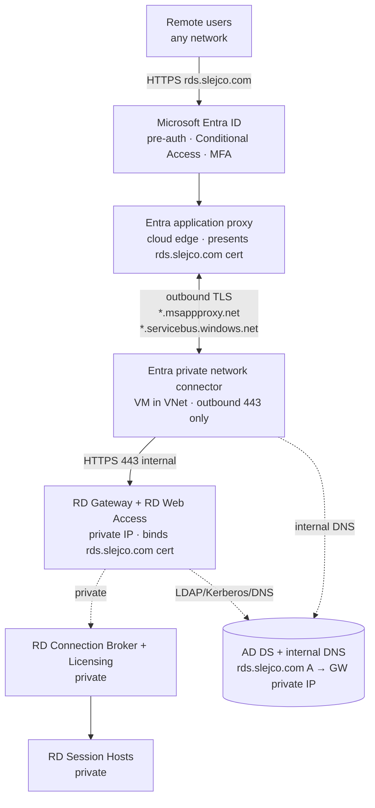
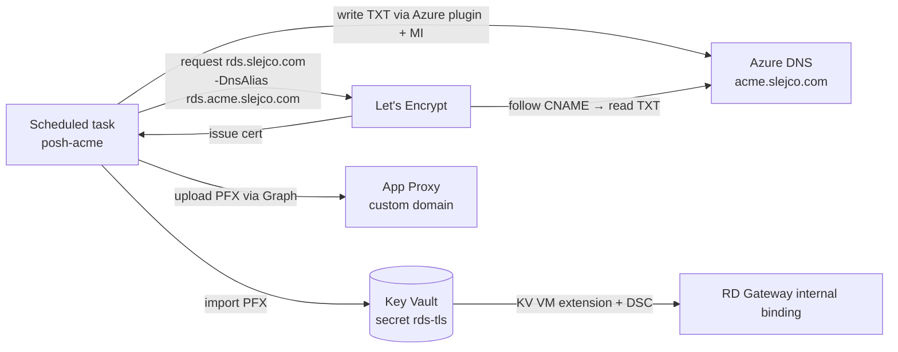

# Publishing RDS through Microsoft Entra application proxy

[← Back to main README](../README.md)

> [!IMPORTANT]
> **The code is implemented; the live farm hasn't cut over yet.** All three phases
> — the cert + Graph scripts, the `useAppProxy` Bicep mode, and the docs/tests —
> are committed, but the farm still runs on its **public** Standard Load Balancer
> (see the main [README](../README.md)) until you enable App Proxy. To switch it
> on, follow the **Deploying — enabling App Proxy** runbook near the end of this
> page; the only work left is the manual prerequisites it calls out (Azure DNS
> delegation, the connector MSI registration, the GoDaddy CNAME). The sections
> before the runbook are the design rationale.

---

## Why application proxy

The current design exposes `TCP 443` + `UDP 3391` from the internet to the RD
Gateway through a Standard Load Balancer, gated by an IP allow-list. Entra
application proxy replaces that with an **outbound-only** model:

- **No public IP, no inbound NSG rules.** The connector dials *out* to Microsoft's
  edge; nothing listens on the internet. The whole inbound attack surface goes away.
- **Entra pre-authentication in front of RDS.** Users authenticate to Entra ID
  first (Conditional Access + MFA), and only assigned users ever reach RD Web.
- **Keep the HTML5 RD Web Client.** Browser-based access at a vanity hostname you
  own, with a publicly trusted certificate.

### At a glance — before vs target

| Aspect | Today (public LB) | Target (application proxy) |
| --- | --- | --- |
| Public ingress | Public IP + Standard LB (`TCP 443`, `UDP 3391`) | None — connector is outbound-only |
| Inbound NSG rules | Allow-list CIDRs → `443` / `3391` on the governance NSG | None inbound from internet; intra-VNet `443` connector → gateway only |
| Pre-auth | None at the edge (RDS handles auth) | Entra ID (Conditional Access + MFA) before RDS |
| Public hostname | `rds-j-slejco.italynorth.cloudapp.azure.com` | `rds.slejco.com` (vanity, you own it) |
| Certificate | Self-signed (cloudapp FQDN) | Let's Encrypt DV, publicly trusted |
| New infra | — | 1+ connector VM in the VNet |
| UDP transport (3391) | Available (perf on lossy links) | **Lost** — App Proxy is HTTPS-only (see limitations) |

---

## Target architecture



The end user only ever talks to Entra ID and the App Proxy cloud edge. The
connector holds a persistent **outbound** tunnel to that edge and forwards
authenticated requests to the gateway's **private** IP. The gateway, broker, and
session hosts never change their private posture.

---

## Hard constraints (from Microsoft docs)

These are non-negotiable requirements pulled from the references at the bottom.
The design below satisfies each one.

| Constraint | Source | How this design meets it |
| --- | --- | --- |
| RD Web + RD Gateway on the **same machine** with a common root, published as a **single** app proxy app (for SSO between them) | RDS integration | Already true — both roles live on the one gateway VM. Publish one app with internal/external URL `https://rds.slejco.com/`. |
| RD Web **Client (HTML5)** requires the **same internal and external FQDN** | RDS integration | Both URLs = `rds.slejco.com`. Split-horizon DNS makes the name resolve internally to the private IP. |
| Custom-domain cert must be a **real, publicly trusted** cert **with private key** (self-signed/expired/missing-key rejected) | Add on-prem app | Let's Encrypt DV cert for `rds.slejco.com`, uploaded as PFX. |
| Connector is **outbound-only**: `443` to `*.msappproxy.net` + `*.servicebus.windows.net`; no inbound | Connector requirements | Connector VM needs only outbound `443`; no inbound NSG rule, no public IP. |
| Do **not** TLS-inspect connector traffic | Connector + proxy | No interception proxy in the connector's egress path. |
| **Entra ID P1** + Application Administrator to publish; synced/cloud identities for pre-auth | Add on-prem app | P1 confirmed available. |
| Connector **v1.5.1975.0+** for the RD Web Client | RDS integration | Install current connector build on the connector VM. |
| **"Use HTTP-Only Cookie" must be OFF** for RDS | RDS integration | Set `isHttpOnlyCookieEnabled = false` when publishing. |
| TLS 1.2 enabled on the connector host | Connector requirements | WS2022 default; verify in DSC. |

> [!WARNING]
> **App Proxy carries HTTPS only — `UDP 3391` does not traverse it.** RDP-over-HTTPS
> through the RD Gateway works fine (that is what the web client and the native
> client use), but the optional **UDP transport** that improves performance on
> lossy/high-latency links is not available through application proxy. For a LAN/VPN
> lab this is irrelevant; flag it if users are on poor remote links.

---

## Locked decisions

The design inputs, all decided 2026-06-17:

| Decision | Choice | Rationale |
| --- | --- | --- |
| Pre-auth mode | **Entra ID** (not pass-through) | Conditional Access + MFA in front of RDS — the main security win. |
| Vanity FQDN | **`rds.slejco.com`** | Owned by you, hosted at GoDaddy. Required for the HTML5 web client. |
| Certificate source | **Let's Encrypt (DV)** via **DNS-01** | No internal CA needed; DV needs only domain control. KV-integrated DigiCert was rejected — it issues **OV** certs that require a validated **organization** in CertCentral, which you don't have. |
| One cert, two bindings | **Yes** | A single `rds.slejco.com` cert serves both the internal RD Web/Gateway IIS binding **and** the App Proxy custom-domain upload. Also retires the old cloudapp-FQDN drift problem. |
| ACME DNS automation | **CNAME delegation to Azure DNS** | GoDaddy gates its Domains API (needs 10+ domains or DDC Premier; you have 2). Delegate only the `_acme-challenge` record to Azure DNS so `posh-acme` can write it via managed identity. |
| Connector count | **1** (lab) | Add a 2nd for production HA. Microsoft recommends a dedicated host, not co-located on the gateway. |
| Public LB | **Removed** (single gateway) | No public ingress. If multiple gateways are added later, front them with an **internal** LB for connector → gateway balancing. |

---

## DNS design (split-horizon)

Three DNS planes. Only the ACME challenge record needs automation; everything else
is static.

> [!NOTE]
> GoDaddy is this farm's registrar; the delegation works with **any** public DNS
> host. See [Make it yours](#make-it-yours) in the deploying runbook for the full
> substitution map.

### 1. Public — GoDaddy (`slejco.com` zone)

All set by hand, once:

| Record | Type | Value | Purpose |
| --- | --- | --- | --- |
| `rds.slejco.com` | CNAME | `<app-id>.msappproxy.net` | Points the vanity name at the App Proxy edge (value shown after you publish the app). |
| `acme.slejco.com` | NS | 4× Azure DNS name servers | One-time delegation of a child zone to Azure DNS. |
| `_acme-challenge.rds.slejco.com` | CNAME | `rds.acme.slejco.com` | One-time static alias so ACME validation chases into the delegated zone. |

### 2. ACME delegation — Azure DNS (`acme.slejco.com` zone) — automated

`posh-acme` creates and deletes the `rds.acme.slejco.com` **TXT** record on every
renewal using the **`Azure` plugin + managed identity**. You never touch it, and
the GoDaddy API is never involved.

### 3. Internal — AD DNS (`slejco.com` zone on the DCs)

| Record | Type | Value | Purpose |
| --- | --- | --- | --- |
| `rds.slejco.com` | A | RD Gateway **private** IP | Lets the connector resolve the internal URL to the private gateway. **Without this the connector would resolve the public CNAME and loop.** |

> [!NOTE]
> Internal `rds.slejco.com` → private IP and public `rds.slejco.com` → `msappproxy.net`
> is the whole point of split-horizon: clients on the internet hit the App Proxy edge;
> the connector inside the VNet hits the gateway directly.

---

## Certificate design — Let's Encrypt via DNS-01

### Why DNS-01

The connector is outbound-only, so there is no public endpoint for an HTTP-01
challenge to hit. **DNS-01** proves domain control by publishing a TXT record —
no inbound required — and works from the DC or any jumpbox.

### Issuance + renewal flow



1. `posh-acme` requests `rds.slejco.com` with `-DnsAlias rds.acme.slejco.com`.
2. It writes the challenge TXT into the **Azure DNS** delegated zone (managed identity).
3. Let's Encrypt follows the GoDaddy CNAME into Azure DNS, reads the TXT, issues the cert.
4. The renewed PFX is pushed to **both** sinks:
   - **Key Vault** secret `rds-tls` → the KV VM extension + DSC `BindRDSCertificates`
     re-bind it on the RDS roles internally (existing mechanism).
   - **App Proxy** custom domain → uploaded via Microsoft Graph for the external edge.

Both sinks need the push regardless of CA; Let's Encrypt just adds the 90-day cadence,
which the scheduled task handles unattended.

> [!NOTE]
> The same publicly trusted cert on the internal binding also satisfies the
> connector's **backend** TLS validation: the connector connects to
> `https://rds.slejco.com/` (private IP) and the gateway presents a cert whose name
> matches and chains to a public root. No name mismatch, no validation bypass needed.

---

## Connector design

- **Placement:** a dedicated Windows Server VM in the RDS VNet (Microsoft recommends
  not co-locating on the gateway). One for the lab; two in different zones for prod HA.
- **Egress (outbound `443`, no inbound):** `*.msappproxy.net`, `*.servicebus.windows.net`,
  plus auth/CRL endpoints (`login.microsoftonline.com`, `*.msauth.net`, `mscrl.microsoft.com`,
  `crl3/crl4.digicert.com`, `ocsp.*`, `ctldl.windowsupdate.com`). Full list in the connector
  reference. **Do not** route this through a TLS-inspecting proxy.
- **DNS:** must resolve the **internal** `rds.slejco.com` (point the connector at the AD DNS
  servers, e.g. `172.16.0.4`).
- **Build:** connector **v1.5.1975.0+** (required for the RD Web Client). TLS 1.2 on.

---

## RDS-side configuration

Once the app is published and DNS/cert are in place, point the deployment at the
external URL (run on the broker):

```powershell
# Route RDS through the proxy external URL, password auth at the gateway
Set-RDDeploymentGatewayConfiguration -GatewayMode Custom `
    -GatewayExternalFqdn 'rds.slejco.com' `
    -LogonMethod Password -UseCachedCredentials $true `
    -BypassLocal $false -Force

# Per collection: require Entra pre-authentication
$preauth = "pre-authentication server address:s:https://rds.slejco.com/`n" +
           "require pre-authentication:i:1"
Set-RDSessionCollectionConfiguration -CollectionName 'DesktopCollection' `
    -CustomRdpProperty $preauth
```

Then enable the RD Web Client and **remove the public endpoints** (the LB + public
IP — handled by the `useAppProxy` Bicep flag in Phase 2). Users connect only to
resources in the RemoteApp/Desktops pane (not "Connect to a remote PC").

---

## Entra publish settings

When `Configure-AppProxy.ps1` creates the on-prem app (Microsoft Graph
`onPremisesPublishing`), the RDS-specific settings are:

| Setting | Value |
| --- | --- |
| Internal URL | `https://rds.slejco.com/` |
| External URL | `https://rds.slejco.com/` (custom domain) |
| Pre-authentication | Microsoft Entra ID |
| Translate URL in headers | No |
| Translate URL in body | No |
| Use HTTP-Only Cookie | **No** (required for RDS) |
| Backend SSO method | None |
| Home page URL (branding) | `https://rds.slejco.com/RDWeb` |
| User assignment | The `RDS-Users` group (only assigned users reach RD Web) |

Layer Conditional Access (require MFA, compliant device, etc.) on the resulting
enterprise app for defense-in-depth.

---

## Repo impact — implementation status

> ✅ done (committed) · ☐ remaining (manual / admin).

### Phase 1 — Entra + cert plumbing ✅

- ✅ `scripts/New-LetsEncryptRdsCertificate.ps1` — `posh-acme` DNS-01 with
  `-DnsAlias` → Azure DNS; import to KV `rds-tls` (only on thumbprint change); stage the PFX.
- ✅ `scripts/Configure-AppProxy.ps1` — Microsoft Graph: instantiate the app,
  `onPremisesPublishing` (Entra pre-auth, RDS flags), custom-domain cert upload,
  connector group, group assignment.
- ✅ DSC — gated `Rds07_PreAuthCustomRdp` step driven by `$PreAuthServerUrl`.
- ☐ Azure DNS zone `acme.slejco.com` + one-time GoDaddy NS delegation + static CNAME (**manual**).
- ☐ Connector VM **software**: MSI install + registration (**admin step** — needs an interactive Entra token).

### Phase 2 — Bicep `useAppProxy` flag ✅

- ✅ `main.bicep` — `useAppProxy`; `publicGatewayFqdn` is the external FQDN in both
  modes; the public IP + load balancer become `if (!useAppProxy)`; a connector VM
  (reusing `modules/vm.bicep`, which already does domain-join + optional identity +
  optional backend pool); `PreAuthServerUrl` wired into the broker DSC; conditional
  outputs via the `!` pattern.
- ✅ `modules/network.bicep` — `writeInternetInboundRules` (= `!useAppProxy`) gates
  the two internet-facing inbound NSG rules.
- ✅ `scripts/Initialize-RdsFarm.ps1` (Tier 0) — `-UseAppProxy` (+ `-PublicGatewayFqdn`
  + Step 6 bicepparam patching).
- ✅ `main.bicepparam` — declares `useAppProxy`; Tier 0 owns the value.

### Phase 3 — Docs + tests

- ✅ This page (status + cutover runbook below).
- ✅ `tests/Test-BicepParamValues.ps1` — App Proxy invariant (valid `publicGatewayFqdn`
  when `useAppProxy`).
- ✅ `tests/Test-PostDeployHealth.ps1` — skips the public-LB checks and resolves the
  App Proxy external FQDN when `useAppProxy`.
- ✅ README architecture diagram + "What it deploys" table.

---

## Deploying — enabling App Proxy

**Who this is for, and what you'll have at the end:** an operator switching the
farm from its public load balancer to Microsoft Entra application proxy. When you
finish, users reach RD Web at `https://rds.slejco.com/RDWeb/` only after signing in
to Entra ID (Conditional Access + MFA), and the farm has **no public inbound**.

Run every `az` / PowerShell step from a host **inside the VNet** (a jumpbox, or a
laptop on the VPN). Key Vault and the artifacts storage account are
private-endpoint-only, so a public machine can't reach them.

> [!WARNING]
> Steps 6 and 7 are a brief outage: between flipping the farm (step 6) and
> registering the connector (step 7), RDS is unreachable. Do them in a planned
> maintenance window.

### Before you start

Have all of these ready — each bullet says how to get or confirm it:

- **An Entra ID P1 (or P2) license** — App Proxy and Conditional Access require it.
  Check in the Entra admin center under *Billing → Licenses*.
- **An account with the Application Administrator role** (to publish the app and
  register the connector). Confirm under *Roles and administrators*.
- **`slejco.com` registered to you with its DNS managed at GoDaddy** — you'll add
  public records there.
- **An `RDS-Users` group in Entra ID** (cloud-only or synced from AD); only its
  members get through. Confirm with `az ad group show --group RDS-Users`.
- **Signed in on the in-VNet host:** `az login` and `gh auth login`, as an account
  with Owner/Contributor on the subscription.

### Make it yours

This runbook uses the reference farm's real names so the commands are
copy-pasteable. To deploy **your** farm, substitute the values below. The scripts
read the FQDN and Key Vault from your Tier 0-owned `main.bicepparam` and **derive**
the ACME zone and alias from the FQDN, so in practice you pass very little.

| Placeholder | This farm (worked example) | Where yours comes from |
| --- | --- | --- |
| External / vanity FQDN | `rds.slejco.com` | `publicGatewayFqdn` in `main.bicepparam` (set by Tier 0), or `-Fqdn` |
| Public DNS host (registrar) | GoDaddy, zone `slejco.com` | wherever your domain's public DNS is hosted |
| ACME challenge zone (Azure DNS) | `acme.slejco.com` | derived as `acme.<parent of FQDN>`; override with `-AcmeDnsZoneName` |
| ACME challenge alias | `rds.acme.slejco.com` | derived as `<first label of FQDN>.<acme zone>`; override with `-DnsAlias` |
| Key Vault | `rdsjslejcokv01` | `keyVaultName` in `main.bicepparam`, or `-KeyVaultName` |
| Access group | `RDS-Users` | `-AssignGroupName` on the publish step (step 4) |

> [!NOTE]
> **Any public DNS host works — GoDaddy isn't special here.** The registrar only
> ever holds **two static records** (the `NS` delegation and one `CNAME`); the
> dynamic ACME `TXT` lives in the Azure DNS child zone, written by managed identity.
> Cloudflare, Route 53, Namecheap, etc. all work identically. If your DNS provider
> has its own [posh-acme plugin](https://poshac.me/docs/) or an unrestricted API,
> you can skip the child-zone delegation entirely and point posh-acme straight at it.

### Fast path — let Tier 0 do steps 1–4

If you bootstrap with **`-CertMode LetsEncrypt`**, Tier 0
([`Initialize-RdsFarm.ps1`](../scripts/Initialize-RdsFarm.ps1)) automates the Azure
side of this runbook: it creates the Azure DNS challenge zone, **prints the exact
NS + CNAME to add at your registrar**, issues the Let's Encrypt cert into Key Vault,
and publishes the App Proxy app. The DNS-01 challenge uses your current `az login`
(no managed identity needed), so the **issuance** works from a laptop on VPN.
`-CertMode LetsEncrypt` implies `-UseAppProxy`.

```powershell
# Run 1 - creates acme.<domain> in Azure DNS and prints the registrar records, then halts.
./scripts/Initialize-RdsFarm.ps1 -GitHubRepo me/rds-farm `
    -CertMode LetsEncrypt -PublicGatewayFqdn rds.slejco.com `
    -AcmeContactEmail you@slejco.com -RdsAccessGroup 'RDS-Users'
    # ...plus your usual Tier 0 args (VNet, AD, storage, Key Vault, ...)

# ...add the printed NS + CNAME at your DNS host, wait for propagation...

# Run 2 - issues the cert, imports it to Key Vault, and publishes the App Proxy app.
./scripts/Initialize-RdsFarm.ps1 -GitHubRepo me/rds-farm `
    -CertMode LetsEncrypt -PublicGatewayFqdn rds.slejco.com `
    -AcmeContactEmail you@slejco.com -RdsAccessGroup 'RDS-Users'
```

> [!IMPORTANT]
> The cert is imported into the **private-endpoint-only Key Vault**, so — like
> every Tier 0 cert mode and like Tier 1 — this must run from a host with **VNet
> line-of-sight** (laptop on VPN or in-VNet jumpbox), not a plain laptop. The
> `az login` token covers the DNS-01 challenge (a public ARM call); the Key Vault
> import is the part that needs line-of-sight. Publishing the app also needs the
> **Cloud Application Administrator** role.

That covers steps 1–4 below. What stays manual — and why it can't be a bootstrap step:

| Still by hand | Step | Why |
| --- | --- | --- |
| NS + CNAME at your registrar | 1 | No registrar API — Tier 0 prints the exact records |
| Public `CNAME` → `…msappproxy.net` | 5 | Registrar-side; target only known after publish |
| Internal split-horizon `A` record | 5 | Needs the gateway **private IP** — a Tier 1 output |
| Flip + deploy the farm | 6 | The deploy is Tier 1 (`Invoke-ManualDeploy.ps1`) |
| Install + register the connector | 7 | Interactive Entra sign-in, on the VM Tier 1 creates |
| Remove the public ingress | 8 | Deliberate, verify-first, post-deploy |

The numbered steps below are the **by-hand walkthrough** of the same flow — use them
if you don't run Tier 0, or to see what it does under the hood.

### 1. Delegate the ACME challenge DNS zone to Azure DNS

**Why:** Let's Encrypt (the certificate authority that issues the cert) proves you
control `rds.slejco.com` by reading a DNS TXT record. GoDaddy's DNS API is locked
down, so you host *just that one challenge record* in an Azure DNS zone the renewal
script can write to, and point GoDaddy at it once. (GoDaddy is just this farm's
registrar — the same two static records work at any DNS host; see
[Make it yours](#make-it-yours).)

Create the zone and print the four name servers Azure assigns it:

```bash
az group create -n rds-dns-rg -l italynorth
az network dns zone create -g rds-dns-rg -n acme.slejco.com
az network dns zone show  -g rds-dns-rg -n acme.slejco.com --query nameServers -o tsv
```

Then, in the **GoDaddy DNS portal** for `slejco.com` (*My Products → DNS → Manage
Zones → slejco.com*), add these two records once — they never change again:

| Host / Name | Type | Value |
| --- | --- | --- |
| `acme` | NS | the four name servers printed above (one NS record each) |
| `_acme-challenge.rds` | CNAME | `rds.acme.slejco.com` |

**Result:** `nslookup -type=NS acme.slejco.com 1.1.1.1` returns the Azure name servers.

### 2. Give the renewal host permission to write the challenge record

**Who/what:** the cert script (`New-LetsEncryptRdsCertificate.ps1`) runs on an
**Azure VM inside the VNet**; that VM's **managed identity** (an Azure AD identity
attached to the VM, used instead of a stored password) writes the TXT record into
the `acme.slejco.com` zone. Grant that identity the least-privilege **DNS Zone
Contributor** role, scoped to only the DNS resource group:

```bash
# <renewal-host-rg>/<renewal-host>: the resource group and name of the in-VNet VM
# you run the cert script on (e.g. a jumpbox that has a system-assigned identity).
PRINCIPAL=$(az vm identity show -g <renewal-host-rg> -n <renewal-host> --query principalId -o tsv)
az role assignment create \
    --assignee-object-id "$PRINCIPAL" --assignee-principal-type ServicePrincipal \
    --role "DNS Zone Contributor" \
    --scope "$(az group show -n rds-dns-rg --query id -o tsv)"
```

**Result:** the identity appears under *rds-dns-rg → Access control (IAM) → Role
assignments*. (No managed identity on the host yet? Add one with `az vm identity
assign`, or use a service principal via the script's `-UseServicePrincipal` switch.)

### 3. Issue the TLS certificate from Let's Encrypt

Run the cert script on the in-VNet host **with `-Staging` first**. *Staging* is
Let's Encrypt's rate-limit-free **test environment** — it issues a cert your
browser won't trust, but it proves the DNS delegation from steps 1–2 works without
spending the strict production quota. When staging succeeds, run again **without**
`-Staging` for the real, browser-trusted certificate:

```powershell
# Test run against staging - validates DNS only; the cert it makes is untrusted.
./scripts/New-LetsEncryptRdsCertificate.ps1 -Fqdn rds.slejco.com -Contact you@slejco.com -Staging

# Real run - issues the trusted cert and imports it into Key Vault.
$cert = ./scripts/New-LetsEncryptRdsCertificate.ps1 -Fqdn rds.slejco.com -Contact you@slejco.com
```

`-Contact` is the email Let's Encrypt uses for expiry notices. `-Fqdn` is your
vanity hostname; the script derives the `acme.slejco.com` challenge zone and the
`rds.acme.slejco.com` alias from it (override with `-AcmeDnsZoneName` / `-DnsAlias`)
and reads the Key Vault from `main.bicepparam`. You can drop `-Fqdn` once the Tier 0
flip in step 6 has set `publicGatewayFqdn` — until then, pass it explicitly.

**Result:** the real run imports the cert into Key Vault secret `rds-tls` and
stages a PFX file. The returned `$cert` object holds `$cert.PfxPath` and
`$cert.PfxPassword` — **you pass both to step 4.**

### 4. Publish the application proxy application

This creates the Entra **enterprise application** that fronts the farm and uploads
the step-3 cert to it:

```powershell
./scripts/Configure-AppProxy.ps1 `
    -PfxPath $cert.PfxPath -PfxPassword $cert.PfxPassword `
    -AssignGroupName 'RDS-Users'
```

It turns on Entra pre-authentication, sets the RDS publishing flags, uploads the
custom-domain cert, creates a **connector group** named `RDS Connectors` (a named
set of connectors that serve an app), and grants `RDS-Users` access.

**Result:** the script prints an **external endpoint** such as
`rds-farm-xxxx.msappproxy.net`. **Copy that value — you point the public CNAME at
it in step 5.** (It's also in the Entra admin center under *Enterprise
applications → RDS Farm (Entra App Proxy) → Application proxy → External URL*.)

### 5. Point the vanity name at the proxy (split-horizon DNS)

`rds.slejco.com` must resolve **differently outside vs. inside** the network —
called *split-horizon DNS*. Outside, clients reach the App Proxy edge; inside, the
connector must reach the gateway directly. Add one record in each zone:

| Add it in… | Host / Name | Type | Value |
| --- | --- | --- | --- |
| **Public:** GoDaddy DNS for `slejco.com` | `rds` | CNAME | the `…msappproxy.net` value from step 4 |
| **Internal:** your AD DNS `slejco.com` zone (DNS Manager on a DC, or `Add-DnsServerResourceRecordA`) | `rds` | A | the RD Gateway VM's **private** IP |

**Result:** from outside the network `nslookup rds.slejco.com` shows the
`msappproxy.net` alias; from a domain-joined host it shows the gateway's private IP.

### 6. Flip the farm to App Proxy mode, then deploy

Two actions, in order.

**6a — Set the App Proxy parameters via Tier 0.** Tier 0
(`Initialize-RdsFarm.ps1`) owns `main.bicepparam`; never hand-edit that file. Pass
the App Proxy flags **plus the exact same arguments you used on your first
Tier 0 run** (VNet, AD, storage, cert, etc. — the full command is in the
[README deployment guide](../README.md#deployment-guide)):

```powershell
# Re-run your original Tier 0 command, adding the App Proxy flag:
./scripts/Initialize-RdsFarm.ps1 -UseAppProxy `
    -PublicGatewayFqdn rds.slejco.com `
    -GitHubRepo 'owner/repo' -AdDomainName slejco.com   # ...and the rest of your Tier 0 args
```

- `-UseAppProxy` turns App Proxy mode on.
- `-PublicGatewayFqdn` is the single external hostname users type — used for both
  the cert subject and the App Proxy external URL (internal == external, which the
  HTML5 web client requires).

This writes `useAppProxy=true` and points `publicGatewayFqdn` and
`certificateSubject` at `rds.slejco.com` in `main.bicepparam`.

**6b — Deploy.** `<sa>` is your artifacts storage account name and `<rg>` is the
farm's resource group — the same two values you pass on every deploy:

```powershell
./scripts/Invoke-ManualDeploy.ps1 -Action what-if -StorageAccount <sa> -ResourceGroup <rg>
./scripts/Invoke-ManualDeploy.ps1 -Action deploy  -StorageAccount <sa> -ResourceGroup <rg>
```

**Result:** the what-if shows a **connector VM** added, the gateway NIC leaving the
load-balancer pool, and the gateway rebound to the `rds.slejco.com` cert with
pre-auth on. The deploy runs the health test automatically at the end.

> [!IMPORTANT]
> The deploy is **incremental** — it does **not** delete the now-unused public IP,
> load balancer, or internet inbound NSG rules. They sit idle until you remove them
> in step 8.

### 7. Install and register the connector software

Step 6 created the connector **VM**, but the **connector software** is installed
and registered by hand — registration opens a browser to sign you in to Entra, so
it can't run inside the deploy. Connect to the new VM `rds-apc-01` (via Bastion) and:

1. In the **Entra admin center** → *Enterprise applications → Application proxy*,
   click **Download connector service**. Use **version 1.5.1975.0 or newer** (the
   HTML5 web client requires it).
2. Run the installer; when it prompts, **sign in as your Application Administrator**
   to register the connector to your tenant.
3. Still in *Application proxy*, find the new connector and **assign it to the
   `RDS Connectors` group** — a drop-down on the connector that tells App Proxy
   "this connector serves that group's apps." (Or run
   `./scripts/Configure-AppProxy.ps1 -ConnectorId <id>` with the connector's id
   from that page.)

**Result:** the connector shows **Status: Active** and sits in the `RDS Connectors`
group in the portal.

### 8. Verify, then remove the old public ingress

1. Browse to `https://rds.slejco.com/RDWeb/`. You should be redirected to the
   **Entra sign-in page** (with MFA) first, then land on RD Web — that confirms
   pre-auth and the connector path work end to end.
2. Run the health test (`<rg>` = the farm resource group):

   ```powershell
   ./tests/Test-PostDeployHealth.ps1 -ResourceGroupName <rg>
   ```

   In App Proxy mode it skips the load-balancer checks and resolves the
   `rds.slejco.com` endpoint instead.
3. Delete the public ingress the incremental deploy left orphaned. `<rg>` = farm
   resource group; `<vnet-rg>` and `<governance-nsg>` = the resource group and name
   of the subnet's governance NSG (the value in `subnetNsgName`):

   ```bash
   az network lb        delete -g <rg> -n rds-gw-lb
   az network public-ip delete -g <rg> -n rds-gw-pip
   az network nsg rule  delete -g <vnet-rg> --nsg-name <governance-nsg> -n Allow-HTTPS-from-AllowedClients
   az network nsg rule  delete -g <vnet-rg> --nsg-name <governance-nsg> -n Allow-UDP3391-from-AllowedClients
   ```

**Result:** no public IP, no load balancer, no internet inbound rules — the only
way in is Entra-authenticated through the connector.

---

## References

- [Publish RDS with Microsoft Entra application proxy](https://learn.microsoft.com/entra/identity/app-proxy/application-proxy-integrate-with-remote-desktop-services)
- [Add an on-premises application for remote access](https://learn.microsoft.com/entra/identity/app-proxy/application-proxy-add-on-premises-application)
- [Connector requirements / work with proxy servers](https://learn.microsoft.com/entra/identity/app-proxy/application-proxy-configure-connectors-with-proxy-servers)
- [Custom domains in application proxy](https://learn.microsoft.com/entra/identity/app-proxy/application-proxy-configure-custom-domain)
- [posh-acme — DNS challenge aliases (CNAME delegation)](https://poshac.me/docs/v4/Guides/DNS-Challenge-Aliases/)
