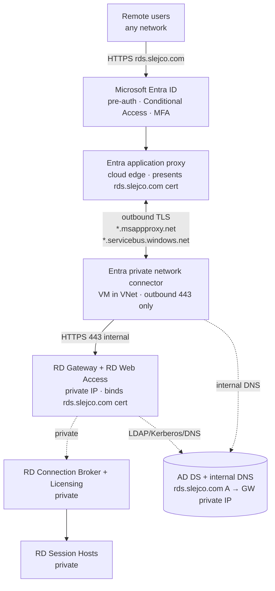
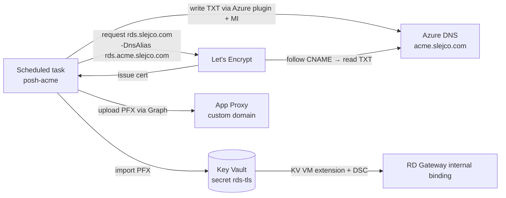

# Publishing RDS through Microsoft Entra application proxy

[← Back to main README](../README.md)

> [!IMPORTANT]
> **The code is implemented; the live farm hasn't cut over yet.** All three phases
> — the cert + Graph scripts, the `useAppProxy` Bicep mode, and the docs/tests —
> are committed, but the farm still runs on its **public** Standard Load Balancer
> (see the main [README](../README.md)) until you enable App Proxy. To switch it
> on, follow the **Deploying — enabling App Proxy** runbook near the end of this
> page; the only work left is the manual prerequisites it calls out (Azure DNS
> delegation, the connector MSI registration, the GoDaddy CNAME). The sections
> before the runbook are the design rationale.

---

## Why application proxy

The current design exposes `TCP 443` + `UDP 3391` from the internet to the RD
Gateway through a Standard Load Balancer, gated by an IP allow-list. Entra
application proxy replaces that with an **outbound-only** model:

- **No public IP, no inbound NSG rules.** The connector dials *out* to Microsoft's
  edge; nothing listens on the internet. The whole inbound attack surface goes away.
- **Entra pre-authentication in front of RDS.** Users authenticate to Entra ID
  first (Conditional Access + MFA), and only assigned users ever reach RD Web.
- **Keep the HTML5 RD Web Client.** Browser-based access at a vanity hostname you
  own, with a publicly trusted certificate.

### At a glance — before vs target

| Aspect | Today (public LB) | Target (application proxy) |
| --- | --- | --- |
| Public ingress | Public IP + Standard LB (`TCP 443`, `UDP 3391`) | None — connector is outbound-only |
| Inbound NSG rules | Allow-list CIDRs → `443` / `3391` on the governance NSG | None inbound from internet; intra-VNet `443` connector → gateway only |
| Pre-auth | None at the edge (RDS handles auth) | Entra ID (Conditional Access + MFA) before RDS |
| Public hostname | `rds-j-slejco.italynorth.cloudapp.azure.com` | `rds.slejco.com` (vanity, you own it) |
| Certificate | Self-signed (cloudapp FQDN) | Let's Encrypt DV, publicly trusted |
| New infra | — | 1+ connector VM in the VNet |
| UDP transport (3391) | Available (perf on lossy links) | **Lost** — App Proxy is HTTPS-only (see limitations) |

---

## Target architecture



The end user only ever talks to Entra ID and the App Proxy cloud edge. The
connector holds a persistent **outbound** tunnel to that edge and forwards
authenticated requests to the gateway's **private** IP. The gateway, broker, and
session hosts never change their private posture.

---

## Hard constraints (from Microsoft docs)

These are non-negotiable requirements pulled from the references at the bottom.
The design below satisfies each one.

| Constraint | Source | How this design meets it |
| --- | --- | --- |
| RD Web + RD Gateway on the **same machine** with a common root, published as a **single** app proxy app (for SSO between them) | RDS integration | Already true — both roles live on the one gateway VM. Publish one app with internal/external URL `https://rds.slejco.com/`. |
| RD Web **Client (HTML5)** requires the **same internal and external FQDN** | RDS integration | Both URLs = `rds.slejco.com`. Split-horizon DNS makes the name resolve internally to the private IP. |
| Custom-domain cert must be a **real, publicly trusted** cert **with private key** (self-signed/expired/missing-key rejected) | Add on-prem app | Let's Encrypt DV cert for `rds.slejco.com`, uploaded as PFX. |
| Connector is **outbound-only**: `443` to `*.msappproxy.net` + `*.servicebus.windows.net`; no inbound | Connector requirements | Connector VM needs only outbound `443`; no inbound NSG rule, no public IP. |
| Do **not** TLS-inspect connector traffic | Connector + proxy | No interception proxy in the connector's egress path. |
| **Entra ID P1** + Application Administrator to publish; synced/cloud identities for pre-auth | Add on-prem app | P1 confirmed available. |
| Connector **v1.5.1975.0+** for the RD Web Client | RDS integration | Install current connector build on the connector VM. |
| **"Use HTTP-Only Cookie" must be OFF** for RDS | RDS integration | Set `isHttpOnlyCookieEnabled = false` when publishing. |
| TLS 1.2 enabled on the connector host | Connector requirements | WS2022 default; verify in DSC. |

> [!WARNING]
> **App Proxy carries HTTPS only — `UDP 3391` does not traverse it.** RDP-over-HTTPS
> through the RD Gateway works fine (that is what the web client and the native
> client use), but the optional **UDP transport** that improves performance on
> lossy/high-latency links is not available through application proxy. For a LAN/VPN
> lab this is irrelevant; flag it if users are on poor remote links.

---

## Locked decisions

The design inputs, all decided 2026-06-17:

| Decision | Choice | Rationale |
| --- | --- | --- |
| Pre-auth mode | **Entra ID** (not pass-through) | Conditional Access + MFA in front of RDS — the main security win. |
| Vanity FQDN | **`rds.slejco.com`** | Owned by you, hosted at GoDaddy. Required for the HTML5 web client. |
| Certificate source | **Let's Encrypt (DV)** via **DNS-01** | No internal CA needed; DV needs only domain control. KV-integrated DigiCert was rejected — it issues **OV** certs that require a validated **organization** in CertCentral, which you don't have. |
| One cert, two bindings | **Yes** | A single `rds.slejco.com` cert serves both the internal RD Web/Gateway IIS binding **and** the App Proxy custom-domain upload. Also retires the old cloudapp-FQDN drift problem. |
| ACME DNS automation | **CNAME delegation to Azure DNS** | GoDaddy gates its Domains API (needs 10+ domains or DDC Premier; you have 2). Delegate only the `_acme-challenge` record to Azure DNS so `posh-acme` can write it via managed identity. |
| Connector count | **1** (lab) | Add a 2nd for production HA. Microsoft recommends a dedicated host, not co-located on the gateway. |
| Public LB | **Removed** (single gateway) | No public ingress. If multiple gateways are added later, front them with an **internal** LB for connector → gateway balancing. |

---

## DNS design (split-horizon)

Three DNS planes. Only the ACME challenge record needs automation; everything else
is static.

### 1. Public — GoDaddy (`slejco.com` zone)

All set by hand, once:

| Record | Type | Value | Purpose |
| --- | --- | --- | --- |
| `rds.slejco.com` | CNAME | `<app-id>.msappproxy.net` | Points the vanity name at the App Proxy edge (value shown after you publish the app). |
| `acme.slejco.com` | NS | 4× Azure DNS name servers | One-time delegation of a child zone to Azure DNS. |
| `_acme-challenge.rds.slejco.com` | CNAME | `rds.acme.slejco.com` | One-time static alias so ACME validation chases into the delegated zone. |

### 2. ACME delegation — Azure DNS (`acme.slejco.com` zone) — automated

`posh-acme` creates and deletes the `rds.acme.slejco.com` **TXT** record on every
renewal using the **`Azure` plugin + managed identity**. You never touch it, and
the GoDaddy API is never involved.

### 3. Internal — AD DNS (`slejco.com` zone on the DCs)

| Record | Type | Value | Purpose |
| --- | --- | --- | --- |
| `rds.slejco.com` | A | RD Gateway **private** IP | Lets the connector resolve the internal URL to the private gateway. **Without this the connector would resolve the public CNAME and loop.** |

> [!NOTE]
> Internal `rds.slejco.com` → private IP and public `rds.slejco.com` → `msappproxy.net`
> is the whole point of split-horizon: clients on the internet hit the App Proxy edge;
> the connector inside the VNet hits the gateway directly.

---

## Certificate design — Let's Encrypt via DNS-01

### Why DNS-01

The connector is outbound-only, so there is no public endpoint for an HTTP-01
challenge to hit. **DNS-01** proves domain control by publishing a TXT record —
no inbound required — and works from the DC or any jumpbox.

### Issuance + renewal flow



1. `posh-acme` requests `rds.slejco.com` with `-DnsAlias rds.acme.slejco.com`.
2. It writes the challenge TXT into the **Azure DNS** delegated zone (managed identity).
3. Let's Encrypt follows the GoDaddy CNAME into Azure DNS, reads the TXT, issues the cert.
4. The renewed PFX is pushed to **both** sinks:
   - **Key Vault** secret `rds-tls` → the KV VM extension + DSC `BindRDSCertificates`
     re-bind it on the RDS roles internally (existing mechanism).
   - **App Proxy** custom domain → uploaded via Microsoft Graph for the external edge.

Both sinks need the push regardless of CA; Let's Encrypt just adds the 90-day cadence,
which the scheduled task handles unattended.

> [!NOTE]
> The same publicly trusted cert on the internal binding also satisfies the
> connector's **backend** TLS validation: the connector connects to
> `https://rds.slejco.com/` (private IP) and the gateway presents a cert whose name
> matches and chains to a public root. No name mismatch, no validation bypass needed.

---

## Connector design

- **Placement:** a dedicated Windows Server VM in the RDS VNet (Microsoft recommends
  not co-locating on the gateway). One for the lab; two in different zones for prod HA.
- **Egress (outbound `443`, no inbound):** `*.msappproxy.net`, `*.servicebus.windows.net`,
  plus auth/CRL endpoints (`login.microsoftonline.com`, `*.msauth.net`, `mscrl.microsoft.com`,
  `crl3/crl4.digicert.com`, `ocsp.*`, `ctldl.windowsupdate.com`). Full list in the connector
  reference. **Do not** route this through a TLS-inspecting proxy.
- **DNS:** must resolve the **internal** `rds.slejco.com` (point the connector at the AD DNS
  servers, e.g. `172.16.0.4`).
- **Build:** connector **v1.5.1975.0+** (required for the RD Web Client). TLS 1.2 on.

---

## RDS-side configuration

Once the app is published and DNS/cert are in place, point the deployment at the
external URL (run on the broker):

```powershell
# Route RDS through the proxy external URL, password auth at the gateway
Set-RDDeploymentGatewayConfiguration -GatewayMode Custom `
    -GatewayExternalFqdn 'rds.slejco.com' `
    -LogonMethod Password -UseCachedCredentials $true `
    -BypassLocal $false -Force

# Per collection: require Entra pre-authentication
$preauth = "pre-authentication server address:s:https://rds.slejco.com/`n" +
           "require pre-authentication:i:1"
Set-RDSessionCollectionConfiguration -CollectionName 'DesktopCollection' `
    -CustomRdpProperty $preauth
```

Then enable the RD Web Client and **remove the public endpoints** (the LB + public
IP — handled by the `useAppProxy` Bicep flag in Phase 2). Users connect only to
resources in the RemoteApp/Desktops pane (not "Connect to a remote PC").

---

## Entra publish settings

When `Configure-AppProxy.ps1` creates the on-prem app (Microsoft Graph
`onPremisesPublishing`), the RDS-specific settings are:

| Setting | Value |
| --- | --- |
| Internal URL | `https://rds.slejco.com/` |
| External URL | `https://rds.slejco.com/` (custom domain) |
| Pre-authentication | Microsoft Entra ID |
| Translate URL in headers | No |
| Translate URL in body | No |
| Use HTTP-Only Cookie | **No** (required for RDS) |
| Backend SSO method | None |
| Home page URL (branding) | `https://rds.slejco.com/RDWeb` |
| User assignment | The `RDS-Users` group (only assigned users reach RD Web) |

Layer Conditional Access (require MFA, compliant device, etc.) on the resulting
enterprise app for defense-in-depth.

---

## Repo impact — implementation status

> ✅ done (committed) · ☐ remaining (manual / admin).

### Phase 1 — Entra + cert plumbing ✅

- ✅ `scripts/New-LetsEncryptRdsCertificate.ps1` — `posh-acme` DNS-01 with
  `-DnsAlias` → Azure DNS; import to KV `rds-tls` (only on thumbprint change); stage the PFX.
- ✅ `scripts/Configure-AppProxy.ps1` — Microsoft Graph: instantiate the app,
  `onPremisesPublishing` (Entra pre-auth, RDS flags), custom-domain cert upload,
  connector group, group assignment.
- ✅ DSC — gated `Rds07_PreAuthCustomRdp` step driven by `$PreAuthServerUrl`.
- ☐ Azure DNS zone `acme.slejco.com` + one-time GoDaddy NS delegation + static CNAME (**manual**).
- ☐ Connector VM **software**: MSI install + registration (**admin step** — needs an interactive Entra token).

### Phase 2 — Bicep `useAppProxy` flag ✅

- ✅ `main.bicep` — `useAppProxy` / `appProxyExternalFqdn`; the public IP + load
  balancer become `if (!useAppProxy)`; a connector VM (reusing `modules/vm.bicep`,
  which already does domain-join + optional identity + optional backend pool);
  `PreAuthServerUrl` wired into the broker DSC; conditional outputs via the `!` pattern.
- ✅ `modules/network.bicep` — `writeInternetInboundRules` (= `!useAppProxy`) gates
  the two internet-facing inbound NSG rules.
- ✅ `scripts/Initialize-RdsFarm.ps1` (Tier 0) — `-UseAppProxy` / `-AppProxyExternalFqdn`
  (+ Step 6 bicepparam patching).
- ✅ `main.bicepparam` — declares `useAppProxy` / `appProxyExternalFqdn`; Tier 0 owns the values.

### Phase 3 — Docs + tests

- ✅ This page (status + cutover runbook below).
- ✅ `tests/Test-BicepParamValues.ps1` — App Proxy invariant (valid `appProxyExternalFqdn`,
  `publicGatewayFqdn` == external FQDN).
- ✅ `tests/Test-PostDeployHealth.ps1` — skips the public-LB checks and resolves the
  App Proxy external FQDN when `useAppProxy`.
- ✅ README architecture diagram + "What it deploys" table.

---

## Deploying — enabling App Proxy (step by step)

End-to-end runbook to switch the farm from the public load balancer to Microsoft
Entra application proxy. Run the **script** steps from an **in-VNet host** (Key
Vault is private-endpoint-only). Expect a short maintenance window between the
deploy (step 6) and connector registration (step 7) when RDS is briefly
unreachable.

> [!NOTE]
> Pre-flight: Entra ID **P1** + an **Application Administrator** account, the
> `RDS-Users` group **synced** to Entra, `slejco.com` publicly owned at GoDaddy,
> and `az` + `gh` signed in.

### 1. Delegate the ACME challenge zone to Azure DNS

Create a public zone for the challenge alias and read its name servers:

```bash
az group create -n rds-dns-rg -l italynorth
az network dns zone create -g rds-dns-rg -n acme.slejco.com
az network dns zone show -g rds-dns-rg -n acme.slejco.com --query nameServers -o tsv
```

Then, at **GoDaddy** (`slejco.com`), add these two **one-time** records:

| Record | Type | Value |
| --- | --- | --- |
| `acme` | NS | the 4 Azure DNS name servers printed above |
| `_acme-challenge.rds` | CNAME | `rds.acme.slejco.com` |

### 2. Let the renewal identity write TXT records

`posh-acme` writes the challenge TXT via the renewal host's managed identity
(default) or a service principal. Grant it least privilege on the zone's RG:

```bash
PRINCIPAL=$(az vm identity show -g <renewal-host-rg> -n <renewal-host> --query principalId -o tsv)
az role assignment create --assignee-object-id $PRINCIPAL --assignee-principal-type ServicePrincipal \
    --role "DNS Zone Contributor" --scope $(az group show -n rds-dns-rg --query id -o tsv)
```

### 3. Issue the Let's Encrypt certificate

From the in-VNet host — **staging first** to validate delegation, then production:

```powershell
./scripts/New-LetsEncryptRdsCertificate.ps1 -Contact you@slejco.com -Staging   # dry run
$cert = ./scripts/New-LetsEncryptRdsCertificate.ps1 -Contact you@slejco.com     # production
```

It imports the cert into Key Vault `rds-tls` and stages a PFX. Keep `$cert` — it
carries `PfxPath` and `PfxPassword` for the next step.

### 4. Publish the application proxy app

```powershell
./scripts/Configure-AppProxy.ps1 -PfxPath $cert.PfxPath -PfxPassword $cert.PfxPassword `
    -AssignGroupName 'RDS-Users'
```

This instantiates the app, sets Entra pre-auth + the RDS flags, uploads the
custom-domain cert, creates the `RDS Connectors` group, and assigns `RDS-Users`.
**Note the `<app>.msappproxy.net` target** it prints (also shown in the Entra
admin center under the app's *Application Proxy* blade).

### 5. Point DNS at the proxy (split-horizon)

| Where | Record | Type | Value |
| --- | --- | --- | --- |
| GoDaddy (public) | `rds` | CNAME | `<app>.msappproxy.net` |
| AD DNS (internal) | `rds` | A | RD Gateway **private** IP |

### 6. Flip the farm to App Proxy mode and deploy

Re-run Tier 0 so it owns the params (never hand-edit `main.bicepparam`):

```powershell
./scripts/Initialize-RdsFarm.ps1 -UseAppProxy -AppProxyExternalFqdn rds.slejco.com `
    -PublicGatewayFqdn rds.slejco.com   # ...plus your usual Tier 0 args
```

That sets `useAppProxy=true` and points `appProxyExternalFqdn`, `publicGatewayFqdn`,
and `certificateSubject` at `rds.slejco.com`. Then deploy:

```powershell
./scripts/Invoke-ManualDeploy.ps1 -Action what-if -StorageAccount <sa> -ResourceGroup <rg>
./scripts/Invoke-ManualDeploy.ps1 -Action deploy  -StorageAccount <sa> -ResourceGroup <rg>
```

The what-if adds the **connector VM**, drops the gateway NIC from the LB backend
pool, and rebinds the gateway to the `rds.slejco.com` cert with pre-auth enabled.

> [!IMPORTANT]
> The deploy is **incremental** — it does **not** delete the existing public IP,
> load balancer, or the internet inbound NSG rules. They are left orphaned;
> remove them in step 8.

### 7. Install + register the connector

The farm deployed the connector **VM** in step 6; the software is an admin step
(registration needs an interactive Entra token). On the new connector VM:

1. Download the **Microsoft Entra private network connector** (Entra admin center →
   *Application proxy* → **Download connector service**) — version **1.5.1975.0+**.
2. Run the installer and sign in as an Application Administrator to register it.
3. In the portal, confirm the connector is **Active**, then move it into the
   **`RDS Connectors`** group (or re-run `Configure-AppProxy.ps1 -ConnectorId <id>`).

### 8. Verify and decommission

- Browse `https://rds.slejco.com/RDWeb/` — you should hit **Entra sign-in**
  (Conditional Access / MFA) first, then RD Web.
- `./tests/Test-PostDeployHealth.ps1 -ResourceGroupName <rg>` (it now skips the
  public-LB checks in App Proxy mode).
- Delete the orphaned public ingress:

  ```bash
  az network lb delete  -g <rg> -n rds-gw-lb
  az network public-ip delete -g <rg> -n rds-gw-pip
  az network nsg rule delete -g <vnet-rg> --nsg-name <governance-nsg> -n Allow-HTTPS-from-AllowedClients
  az network nsg rule delete -g <vnet-rg> --nsg-name <governance-nsg> -n Allow-UDP3391-from-AllowedClients
  ```

> [!WARNING]
> Don't upload a Let's Encrypt **staging** cert to App Proxy — browsers reject the
> staging chain. Use `-Staging` only to validate the DNS-01 flow (step 3), then
> issue and upload the production cert.

---

## Prerequisites checklist

Before Phase 1 starts:

- ☐ Entra ID **P1** licensed (confirmed) and an **Application Administrator** account.
- ☐ `slejco.com` publicly owned and managed at GoDaddy (confirmed).
- ☐ An Azure DNS **public zone** for `acme.slejco.com` and a **managed identity** with
  *DNS Zone Contributor* on it (for `posh-acme`).
- ☐ Subnet/route for the connector VM with **outbound `443`** to the App Proxy endpoints.
- ☐ Internal DNS authority to add the split-horizon `rds.slejco.com` A record.
- ☐ The `RDS-Users` group synced to Entra ID (pre-auth needs cloud identities).

---

## References

- [Publish RDS with Microsoft Entra application proxy](https://learn.microsoft.com/entra/identity/app-proxy/application-proxy-integrate-with-remote-desktop-services)
- [Add an on-premises application for remote access](https://learn.microsoft.com/entra/identity/app-proxy/application-proxy-add-on-premises-application)
- [Connector requirements / work with proxy servers](https://learn.microsoft.com/entra/identity/app-proxy/application-proxy-configure-connectors-with-proxy-servers)
- [Custom domains in application proxy](https://learn.microsoft.com/entra/identity/app-proxy/application-proxy-configure-custom-domain)
- [posh-acme — DNS challenge aliases (CNAME delegation)](https://poshac.me/docs/v4/Guides/DNS-Challenge-Aliases/)
